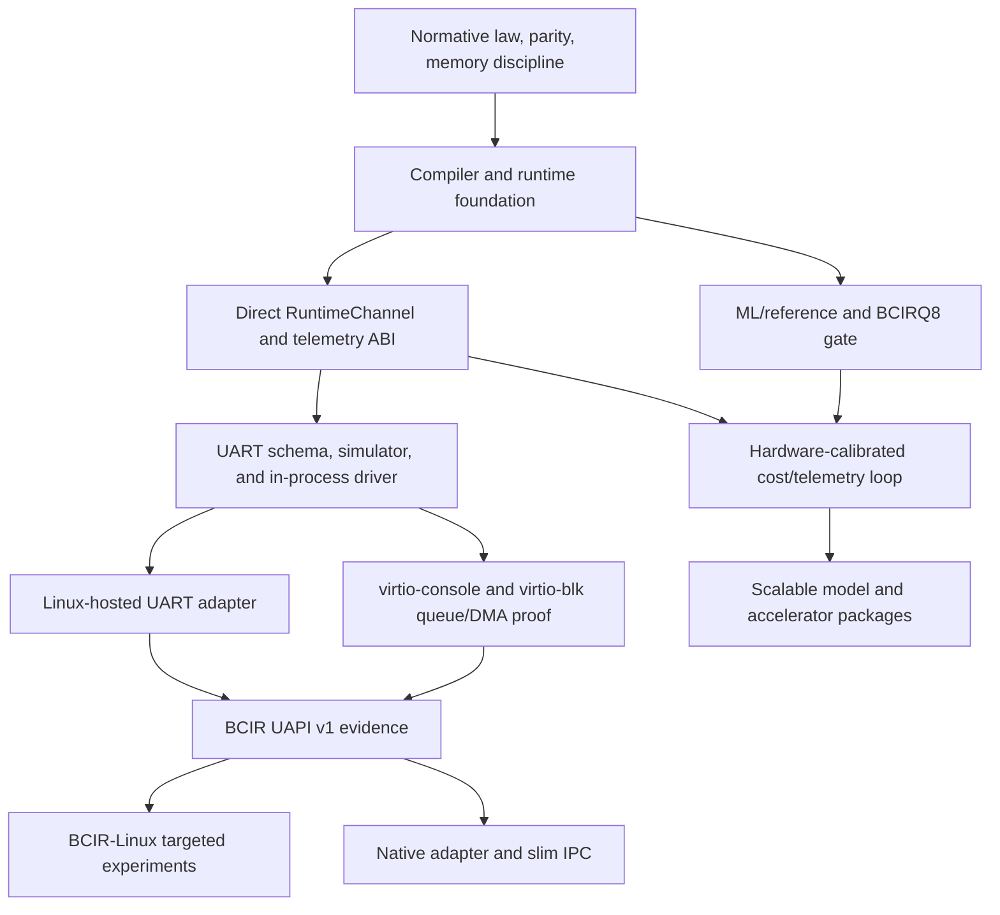

# BCIR Master Roadmap

> **Scope:** current execution plan for package version `0.2.0`.
>
> This document owns cross-program order, promotion gates, and stop conditions. It does
> not carry test counts, PR chronology, or completed-wave notes. Static inventories come
> from generated [`STATUS.md`](STATUS.md); implementation truth is summarized in
> [`REPO_CURRENT_STATE_AUDIT.md`](REPO_CURRENT_STATE_AUDIT.md); the build record lives in
> [`DEVELOPMENT_HISTORY.md`](DEVELOPMENT_HISTORY.md). The `0.3b` release notes remain an
> unreleased draft.

## 1. Mission and non-negotiable invariants

BCIR is a registry-first, phase-ordered, lane-typed, cost-governed correspondence IR.
It preserves a computation's semantic claim, legal physical realizations, selected plan,
GEM schedule, target lowering, and provenance as one auditable chain.

Every program in this roadmap obeys these invariants:

1. **Legality precedes optimization.** R1–R23 and device-specific laws reject illegal
   candidates before K_BCIR prices them.
2. **One semantic truth, multiple realizations.** Python is the executable oracle; MLIR is
   the compiled law rail; C is the freestanding/hosted realization rail. A new rail earns
   support through differential parity, not assertion.
3. **Learning proposes; certificates dispose.** Learned or measured data may rank and
   calibrate legal choices. It never becomes a legality verdict or steers in-flight work.
4. **Artifacts are immutable within a generation.** Plans, StreamPacks, model weights,
   driver programs, and learned priors are content-addressed, generation-tagged, and stale
   on any relevant input change.
5. **The core is platform-neutral.** Linux, Windows, POSIX, vendor runtimes, IPC, and hosted
   allocation are adapters around the direct contracts; none becomes the definition of BCIR.
6. **Unsupported work fails honestly.** Partial AOT, modeled channels, compiler fixtures,
   portable fallbacks, and hardware-gated code are labeled as such.
7. **Evidence controls promotion.** A feature needs implementation, deterministic positive
   coverage, refusal coverage where malformed input exists, and all required CI checks.

The normative semantics and artifact contract are in
[`BCIR_LANGREF.md`](BCIR_LANGREF.md). The Python↔MLIR↔C correspondence is governed by
[`PARITY.md`](PARITY.md).

## 2. Architecture and current baseline

### 2.1 IR levels

| Level | Responsibility | Current realization |
|---|---|---|
| BCIR-0 | Semantic claims and state transformations | Python model/frontends; MLIR BCIR dialect |
| BCIR-1 | Shaped data, layouts, records, tensors | Resource/layout model; GEM tensor ops; binary-record/model frontends |
| BCIR-2 | Registry and placement candidates | Registry, device manifests, memory banks, channels, generations |
| BCIR-3 | Legal K_BCIR realization plan | Exact integer cost search, RCSP/Pareto, schedule-aware price, certified priors |
| BCIR-4 | GEM execution and StreamPack | Hydration, wave/token scheduling, v1–v3 StreamPack, C executor |
| BCIR-5 | Target lowering | Partial LLVM/MLIR, portable C23, WASM/JVM/CIL subsets, SYCL/SPIR-V channel, resident toolchains |

### 2.2 Implementation rails

| Rail | Owns | Explicit boundary |
|---|---|---|
| `bcir/` | Dependency-free conformance oracle plus import-quarantined hosted-model adapters, K_BCIR, GEM, frontends, ML/reference organs | Hosted PyTorch execution is optional and must re-enter through strict oracle ingestion; not the production law definition |
| `mlir/` | ODS/IRDL structure, compiled verifier and transformations, target-edge lowering | `bcir-aot` is partial preparation; Python LLVM lowering accepts one supported elementwise claim |
| `runtime/c/` | Freestanding runtime, C-front twin, hosted model/compiler tools, direct RuntimeChannel | Memory classes are explicit; no hidden platform or IPC dependency in freestanding code |
| `runtime/cpp/` | Hosted orchestration above the C ABI | Single-node handoff is real; distributed/device-manager backends remain scaffolded |
| LLVM/Clang/GCC/vendor stacks | General-purpose isel, register allocation, object production, vendor device/runtime internals | Consumed rather than reimplemented unless a decision gate proves a missing BCIR-owned requirement |

### 2.3 Source-backed status

| Area | Landed baseline | Boundary that remains |
|---|---|---|
| Law and optimizer | R1–R23, twelve-axis cost vectors, exact planning, RCSP/Pareto, overlap pricing, replay/provenance, frozen learned priors | Additional laws require a demonstrated semantic gap and dual-rail negative coverage |
| GEM and StreamPack | Hydration, scheduling, execution, strict v1–v3 codecs, C/Python byte parity, operator disassembly/hexdump | Hardware command packets and per-device execution are not implied |
| C compiler | Broad driver-oriented C23 subset, twin lowering, Clang differentials, target ABI matrix, project/link/fallback modes | Not complete ISO C23; unsupported constructs route to the resident compiler |
| C memory/runtime | Freestanding/hosted/driver classes, allocator injection, failure tests, direct RuntimeChannel v1 | No out-of-process transport or resident hardware binding |
| ML/reference | Tensor claims, closed-set AD, planned/streamed training, optional hosted Llama/AdamW micro training, safe resume/export, model ingest/tokenizer/decode, BCIRQ8, standalone-C parity, native Q8/Q4 conversion and Q8 projection kernels, exact native Q15 retrieval, payload-free placement, exact static tensor addresses, verified HAM residency/routes, strict context shards, dual-memory oracle, a bounded GNN/Transformer hardware-policy gate, adaptive architectures, and raw-byte BLT/MambaByte experiments | The 32M and byte-native models are untrained at useful scale; hardware-RL evidence is simulated; HAM has no physical adapter; no whole-model Q4, distributed trainer, GPU byte/model backend, live promotion corpus, or production serving engine |
| Telemetry | Stable signal registry, BTLM codec, continuity/ring witnesses, metrics, deterministic Prometheus/OTLP/Redfish-shaped serialization | No live HTTP/OTLP/BMC/UART transport; driver envelope/live concurrent ring remain version-zero design work |
| Machine edge | Typed MMIO/port/fence/control-register/MSR operations, ordinary x86 long-mode entry and interrupt trampoline, real object/disassembly gates | Reset transition, paranoid NMI/IST entry, feature-specific entry policy, native CPU backend remain open |
| Drivers/kernel | Device-manifest/event/DMA substrates, direct hook ABI, generic HAM compiler/simulator contract, driver package and BCIR-Linux plans | No resident device driver, GDS/P2PDMA/CXL/NVMe adapter, Linux module/fork, stable UAPI, native kernel, or native IPC is present |
| Performance evidence | Bounded cross-organ audit, deterministic result digests, controlled-box budget rail, exact scheduler/static-layout differential tests | Target-specific TMSAO certificate still needs PMU/energy/thermal evidence and exhaustive measured candidates |

The exact driver boundary is maintained in
[`kernel/BCIR_DRIVER_KERNEL_ROADMAP.md`](kernel/BCIR_DRIVER_KERNEL_ROADMAP.md). Machine-code
coverage and GO/STOP rules are maintained in
[`BCIR_MACHINE_CODE_HAL_ISA_AUDIT.md`](BCIR_MACHINE_CODE_HAL_ISA_AUDIT.md) and
[`BCIR_NATIVE_OBJECT_GATE.md`](BCIR_NATIVE_OBJECT_GATE.md).

## 3. Dependency order

The driver and ML programs share compiler, runtime, telemetry, artifact, and validation
machinery. Neither may bypass the other's prerequisites: model acceleration needs real device
packages; learned driver optimization needs stable direct behavior and trace identity.

## 4. Active workstreams

### 4.1 Language and compiler rail

Current work is maintenance and bounded completion, not another breadth sprint:

- Keep C-front twin/Clang equivalence, project linking, diagnostics, target ABI, and memory
  discipline green while driver fixtures become real programs.
- Add C standard-library/compiler surfaces only when a driver or model slice requires them.
  Near-term ML-relevant gaps are `<stdbit.h>`, `<stdckdint.h>`, verifier-fed `assume`, and
  packed sub-byte storage/compute semantics.
- Preserve the C++ airlock: C owns stable value/resource ABI; C++ owns hosted graph and
  distributed orchestration. Implement a backend only with an executable consumer and teardown
  tests.
- Place any future C++, Python, Java, Fortran, CIL, JVM, or other language roadmap under
  [`languages/`](languages/). Use fallback/standard ABI integration before proposing a full
  frontend.

Promotion gate: twin parity, relevant Clang/GCC differentials, strict warnings, sanitizer and
allocator-failure coverage, target-aware linking, and no expansion of the freestanding dependency
surface.

### 4.2 Machine-code and backend rail

LLVM remains the resident implementation of general CPU machine-code work. BCIR currently owns
typed target/device edges, StreamPack/operator tools, verification, and device-command assembly.
The next sequence is:

1. Complete source-module symbol resolution and a freestanding C twin for MC1 disassembly.
2. Bind MC2 registry operations through RuntimeChannel only after a real driver resource exists.
3. Build MC3–MC9 from the concrete UART/virtio command and lifecycle needs.
4. Treat MC10–MC14—native isel, object/link, ABI frame, debug metadata, and binary trust—as a
   separate backend program behind the native-object decision gate.
5. Build MC15 telemetry identity before freezing a driver UAPI.

ELF/DWARF conformance means consuming platform formats and system linkers correctly; it does not
authorize a new general-purpose linker or debugger. See
[`BCIR_MACHINE_CODE_HAL_ISA_AUDIT.md`](BCIR_MACHINE_CODE_HAL_ISA_AUDIT.md).

### 4.3 Driver, Linux, and native-kernel rail

The canonical order is evidence-first:

1. Finish the version-zero driver telemetry envelope and generated signal table.
2. Implement the 16550/16750 UART schema, assembler/verifier/simulator, polled direct driver,
   event-driven direct driver, and deterministic replay corpus.
3. Add the Linux-hosted UART adapter and prove direct/adapter parity.
4. Establish the separate BCIR-Linux LTS/next rails and stock-Linux baseline.
5. Prove queue/DMA behavior with virtio-console and virtio-blk.
6. Freeze UAPI v1 only after UART and virtio-blk cover MMIO/event and queue/DMA lifecycles.
7. Implement slim native IPC only after direct, Linux, and native traces agree.

Driver packages reuse one authoritative device schema to generate register/packet definitions,
assembler, decoder, verifier, simulator, RuntimeChannel binding, telemetry schema, replay corpus,
and target-specific frozen priors. Linux and native adapters surround identical direct behavior.
The full maturity ladder and kernel escalation policy live in
[`kernel/BCIR_DRIVER_KERNEL_ROADMAP.md`](kernel/BCIR_DRIVER_KERNEL_ROADMAP.md).

### 4.4 ML and model rail

Six bounded seams are proven: immutable TinyLlama inputs produce a deterministic group-Q8 artifact
with Python/C parity; the optional hosted lab trains a 90,688-element model from random weights
through exact safe resume, strict Safetensors ingestion, BCIRQ8, and standalone C; an offline
provider-neutral gate exercises generated-corpus pretraining, SFT, reward, DPO, PPO, verified
reasoning, embedding distillation, and three small architecture families with deterministic replay;
a tiny hardware policy combines an availability-aware telemetry Transformer, memory-topology GNN,
metric reward/DPO/PPO, bounded PUCT, verified plan lowering, and exact static addresses; an adaptive
lab validates tied depth, fixed-residual variable widths, reference-sliding, exogenous anchors, and
multi-patch models; and a byte-native lab validates raw-byte BLT/BLT-D/BLT-S/BLT-DV, learned
patching, MambaByte, exact-shape global transplantation, and measured ingest selection. Both
architecture labs use tiny hosted training and ordinary verified claims/StreamPack without adding
their experimental shapes to BCIRQ8 or the C decoder.
The generic HAM slice adds semantic-resource DAGs, declared-link routing, dynamic residency and
generation replay, context-shard activation, and a fuzzy-ranking/hard-fact-veto memory oracle.
Its gate is simulated and deliberately cannot issue a live promotion certificate.
The Python/native placement audit has also closed the current high-confidence CPU data-plane
ports: group Q8/Q4 conversion, standalone-Q8 matvec/head loops, exact Q15 retrieval, and native
bounded model measurement. The independent Python oracle remains mandatory. See
[`BCIR_PYTHON_NATIVE_BOUNDARY_AUDIT.md`](machine-learning/BCIR_PYTHON_NATIVE_BOUNDARY_AUDIT.md);
future native work must present a measured bottleneck and a stable differential contract.

Generated weights remain build-only. The active queue is:

1. Extend the landed BCIRQ4T/AVX2/SmoothQuant tensor slice to whole-decoder Q4, model-level
   compactness/drift/NLL, ARM/other targets, and independently specified additional formats.
2. Qualify the landed measured schedule artifact on at least two real targets and publish GEMM
   versus fused/attention evidence separately before target promotion.
3. Qualify differentiate-high/optimize-low and rematerialization on representative graphs; keep
   aliased mutation, unbounded control, recursion, and dynamic higher-order calls quarantined.
4. Differentially freeze the pinned 16,384-piece tokenizer, then train and evaluate the specified
   BCIR-TinyStories-32M model on a canonical hosted rig; local work is pilot-only.
5. Establish SDPA device parity, static request-owned KV/CUDA graphs, then verified BCIRQ8 GPU
   execution before defining BCIRQ4 or custom attention kernels.
6. Replay real CPU and driver episodes through the hardware policy; add verified
   rematerialize/checkpoint/KV-reuse actions on top of the landed HAM action rail; compare policy-guided search with exhaustive portfolios on two
   physical targets; freeze deployment weights only after measured, quiescent promotion/rollback.
7. Extend the landed payload-free resident/layer-stream/host-device planner into executable
   batching and hardware-qualified placement, then complete sampling, raw-text standalone
   tokenization, bounded serving, and architecture coverage in that order.
8. Implement live teacher/remote-compute adapters only behind the provider-neutral artifact ABI,
   explicit credentials/policy, cost limits, and offline replay; embeddings remain frozen targets.
9. Extend the landed bounded HAM/dual-memory oracle with durable ingest/index/recovery only behind
   schema, provenance, corruption, recall/filter-parity, and bounded-memory contracts.
10. Profile adaptive per-shape kernels and fused fixed-residual carry on two targets before defining
    checkpoint/export schemas, GQA/native parity, or any production architecture promotion.
11. Evaluate byte-native corpus quality and patch distributions, then add safe checkpoint/export,
    fused local/scan/patch kernels, two-target measurements, and only afterward a native/GPU
    inference format. Architecture-specific byteified Llama/Gemma mappings require exact tensor
    provenance and quality recovery; device-side UTF-8/ingest and DMA overlap remain driver work.

The detailed closure register, model ladder, and explicit production gaps are in
[`machine-learning/BCIR_ML_AI_INTEGRATION_ROADMAP.md`](machine-learning/BCIR_ML_AI_INTEGRATION_ROADMAP.md).

### 4.5 Telemetry and continual optimization

Telemetry is driver/kernel infrastructure, not a dashboard afterthought. The progression is:

- stable signal IDs, units, kinds, and snapshot semantics;
- strict frame and bounded-ring integrity with source/session/generation/clock/loss identity;
- deterministic derived metrics and claim/plan/PC correlation;
- offline replay, calibration, exhaustive-equivalence certificates, and immutable next-generation
  artifacts;
- activation only at quiescent generation boundaries with rollback.

Live transports are adapters. Prometheus text and OTLP/Redfish-shaped JSON do not imply HTTP,
protobuf, gRPC, BMC, or UART delivery. Normative details live in
[`kernel/SIGNAL_REGISTRY.md`](kernel/SIGNAL_REGISTRY.md),
[`kernel/TELEMETRY_FRAME_ABI.md`](kernel/TELEMETRY_FRAME_ABI.md), and
[`kernel/TELEMETRY_PIPELINE_RESEARCH.md`](kernel/TELEMETRY_PIPELINE_RESEARCH.md).

## 5. Program milestones

| Milestone | Current state | Exit evidence |
|---|---|---|
| Foundation law/parity | Landed | R1–R23 negative coverage, generated differentials, deterministic replay |
| C/runtime memory discipline | Landed baseline | Strict hosted/freestanding builds, allocation-failure campaign, sanitizers, idempotent teardown |
| Pre-driver machine edge | Partial landed | Ordinary x86 edge and MC1/MC2 baselines; paranoid/reset and hardware binding remain explicit |
| UART direct package | Open | D0–D2 schema/assembler/verifier/simulator/direct parity, faults, cancellation, saturation, replay |
| UART Linux adapter | Open | D3 direct/adapter behavioral parity and unload/restart safety |
| virtio queue proof | Open | Character/event plus block/DMA lifecycle, reset and saturation evidence |
| BCIR UAPI v1 | Gated | UART + virtio-blk evidence, generated ABI tests, compatibility and failure matrix |
| BCIR-Linux experiment rails | Open | Reproducible LTS/next baselines; invasive patches only for measured stock-interface gaps |
| Native kernel/IPC proof | Gated | Boot/memory/IRQ/PCIe/DMA prerequisites and direct/Linux/native parity |
| Small real-model reference | Landed | Pinned source hashes, BCIRQ8 compactness, Python/C ID and logit parity |
| Hosted train-to-C micro gate | Landed | Random-weight CPU training, exact resume, deterministic Safetensors/Q8 export, Python/C parity |
| Adaptive architecture lab | Bounded reference landed | Per-shape fusion/counters on two targets, export schema, GQA/native parity, and quality evaluation |
| Payload-free model planning | Landed baseline | Header inventory, exact memory report, measured intervals, placement candidates, verified claim/StreamPack plan; target execution remains open |
| HAM/model-artifact fabric | Compiler/simulator baseline landed | Semantic DAG, exact declared-link routes, capacity/generation replay, StreamPack lowering, context-shard rollback, and dual-memory hard veto; physical GDS/P2PDMA/CXL/NVMe adapters remain driver-gated |
| Hardware RL plan policy | Bounded simulated gate landed | Real telemetry corpus, exhaustive two-target comparison, verified rematerialization/spill actions, frozen deployment artifact, measured quiescent promotion/rollback |
| BCIR-TinyStories-32M | Spec/pins landed | Tokenizer differential, canonical BF16 run, validation/model card, reviewed publication artifacts |
| Low-bit/model scaling | Partial | Versioned format, R17/error evidence, target execution, sampling/batching/placement gates |
| Closed learned optimization loop | Partial | Real driver/model telemetry, exhaustive-equivalence certificate, quiescent activation and rollback |

Milestone status is descriptive, not a test report. Exact repository inventories remain generated
in [`STATUS.md`](STATUS.md).

## 6. Release policy

### 6.1 Current package

`0.2.0` is the current package version. Its supported claims are the checked-in interfaces and
explicit subsets documented by the LangRef, parity ledger, C-front guide, and current-state audit.
No document may claim a later tag or stable driver/kernel ABI.

### 6.2 Draft 0.3b

[`RELEASE_NOTES_0.3b.md`](RELEASE_NOTES_0.3b.md) is an unreleased candidate definition for a
freestanding driver-oriented C compiler/runtime milestone. It may advance only when:

- the documented C subset, fallback contract, project linking, and target ABI matrix agree on both
  rails;
- all runtime C memory, sanitizer, fuzz, differential, and strict-warning gates pass;
- the first direct driver package proves lifecycle and telemetry integration;
- docs and generated inventories contain no release/version/support drift.

### 6.3 Later releases

Later versions are evidence-based, not date-based. A stable UAPI release follows UART and
virtio-blk. A native-kernel release follows boot/runtime and direct/Linux/native parity. A model
serving release follows sampling, tokenizer, batching, device, safety, and evaluation gates.

## 7. Validation and publication gate

Every runtime/compiler/driver/ABI change must map to the complete required CI inventory. Locally,
run bounded focused gates and the complete supported x86 suites with at most two workers; do not use
unbounded fuzzing, nested high-parallelism builds, or local architecture emulation. Managed CI/cloud
owns Windows, native ARM, long fuzzing, analyzers, and future kernel matrices.

Minimum publication evidence:

1. Generated status, Markdown links, retired paths, import quarantine, and `git diff --check`.
2. Quick and thorough Python suites with exact outcomes recorded.
3. Strict C11/C23 warnings plus ASan/UBSan/LSan, allocator-failure and ownership checks.
4. Bounded differential/fuzz campaigns with fixed seeds and deterministic regressions.
5. MLIR ODS/IRDL/pass/assembly/object gates on the supported LLVM version.
6. Wire-format corruption, truncation, overlap, reserved-field, CRC, and round-trip tests.
7. Real-model gate for any change that can affect model ingest, quantization, decoding, or C math.
8. Hosted train/checkpoint/export gate on Ubuntu and Windows for hosted-model changes.
9. Native Windows and ARM jobs for portability-sensitive changes.
10. All required GitHub checks green before handoff; pending is not complete.

Hardware claims additionally require the runbook in
[`kernel/HARDWARE_VALIDATION.md`](kernel/HARDWARE_VALIDATION.md), including baselines,
measurement validity, toolchain/profile identity, and honest degraded/skipped results.

## 8. Decision boundaries

- **AOT:** Python LLVM lowering remains a single-claim elementwise subset; MLIR `bcir-aot`
  remains partial preparation. Arbitrary-graph native lowering is a separate approved program.
- **Native backend:** use LLVM/resident toolchains until the native-object gate demonstrates a
  repeated BCIR-owned gap with bounded scope and maintenance ownership.
- **Vendor drivers:** inherit or wrap AMDGPU/ROCm, NVIDIA/CUDA, and other vendor stacks unless
  measurement justifies an independently reviewed replacement effort.
- **IPC:** direct in-process RuntimeChannel first. Process separation requires privilege isolation,
  crash containment, vendor isolation, or multi-client sharing and must preserve behavior.
- **Linux fork:** stock interfaces and out-of-tree adapters establish the baseline. Fork patches
  require a measured residual gap, rollback, rebase, and upstreamability analysis.
- **Learning:** no model inference on L0, no in-flight plan steering, no uncertified artifact
  activation, and no learned legality.
- **Standards:** consume ELF/DWARF/POSIX/IDL/schema ecosystems where useful; do not reimplement a
  standard without two concrete consumers or a documented device-local need.
- **Production claims:** a fixture, fallback, simulator, modeled channel, or one real-model parity
  gate is not production support.

## 9. Risk register

| Risk | Control / stop condition |
|---|---|
| Roadmaps outrun code | Current-state audit cites source/tests; generated status owns counts; unsupported paths stay explicit |
| C memory regressions grow with complexity | Memory classes, allocator injection, fail-every-allocation tests, sanitizers, idempotent teardown |
| Linux fork consumes the project | Separate repository, LTS/next rails, small patch queues, stock/out-of-tree evidence first |
| UAPI freezes around a toy driver | UART and virtio-blk are mandatory before v1 |
| Native backend duplicates LLVM | Native-object GO/STOP gate and resident-toolchain default |
| Learned optimization changes semantics | Two-truth quarantine, exact legality, exhaustive-equivalence certificates, generation rollback |
| Telemetry silently changes meaning | Numeric signal registry, explicit kind/unit/source/clock/generation/loss, append-only versioning |
| Model scope becomes a framework rewrite | Small reference ladder, integrate trusted libraries, explicit production-serving gates |
| Local validation harms workstation stability | Two-worker cap, serialized heavy jobs, bounded campaigns, no local ARM emulation |
| Compatibility claims blur source/binary/emulated support | Generated matrices and separate Linux ABI, POSIX source, and selected binary levels |

## 10. Document ownership

| Location | Owns |
|---|---|
| `docs/` | Normative law, master execution order, current state, parity, releases, onboarding, history, repository structure |
| `docs/kernel/` | Drivers, RuntimeChannel/UAPI/IPC, StreamPack, hardware validation, telemetry, channels, SYCL |
| `docs/machine-learning/` | ML/AI roadmap, model/reference ladder, language placement, model provenance, hosted-AI integration research |
| `docs/languages/` | C frontend/memory/C++ boundary and future language-specific frontend/lowering plans |
| `docs/research/` | Comparative/feasibility studies and non-normative optimization research |

When documents conflict, authority is: **LangRef → generated/static evidence and implementation →
current-state audit → this roadmap → companion roadmaps → research notes → development history**.
History explains past decisions but does not reopen superseded sequencing.

## 11. Immediate priority queue

1. Keep the merged correctness, portability, memory-discipline, x86-edge, StreamPack, telemetry,
   and model gates green while this documentation taxonomy lands.
2. Finalize version-zero driver telemetry identity and generated signal definitions.
3. Execute UART U0–U2: authoritative schema, assembler/decoder/verifier, simulator, then direct
   polled RuntimeChannel binding.
4. Add event-driven UART lifecycle, replay, fault, saturation, cancellation, and teardown evidence.
5. In parallel, prototype the A1 packed-low-bit contract and B1 measured schedule comparison on
   available hardware without blocking the UART proof.
6. Keep HAM hardware work at the documented HMF-D0–D5 gates: capability adapters first, then
   GDS/P2PDMA/CXL/NVMe work only after relevant driver/kernel prerequisites and physical rigs.
7. Start BCIR-Linux and native-kernel implementation only at their explicit dependency gates.

Completed-wave details and the former master roadmap's capability-by-capability ledger are retained
in [`DEVELOPMENT_HISTORY.md`](DEVELOPMENT_HISTORY.md).
