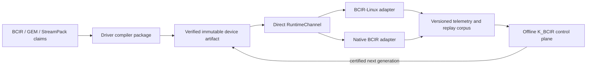

# BCIR Driver and Kernel Roadmap v2

> **Status:** canonical execution roadmap, rewritten 2026-07-15; memory-fabric boundary
> reconciled 2026-07-18.
>
> This document defines how BCIR develops driver/compiler packages, experiments on Linux,
> and eventually hosts those packages in a native BCIR kernel. It replaces the historical
> Parts I–X chronology, but it does **not** discard unfinished work. Every former H/A/B/MC
> item is retained below in a code-backed gap register; only superseded sequencing and stale
> static counts are removed.
>
> This is a roadmap, not an implementation claim. Repository-wide static inventories come
> only from the generated [`STATUS.md`](../STATUS.md). The current code boundary is stated in
> [§2](#2-current-baseline).

## 1. Mission and product split

The goal is not to hand-write another collection of unrelated C drivers. A BCIR driver is a
**proof-carrying compiler package**: it compiles BCIR/GEM/StreamPack claims into a verified
device program, executes that program through a stable value ABI, records structured evidence,
and improves future artifacts through the shared K_BCIR control plane.

The program has three coordinated products:

| Product | Repository | Responsibility | Explicit non-goal |
|---|---|---|---|
| **BCIR Driver Development Kit (DDK)** | This repository | Device schemas, lowering, assembly, verification, simulation, RuntimeChannel bindings, telemetry, optimization artifacts, and conformance tests | Owning a general-purpose CPU/GPU instruction selector or embedding Linux internals in the driver core |
| **BCIR-Linux** | Separate `Mecca-Research/BCIR-Linux` fork | Bootable compatibility oracle, Linux-hosted driver adapters, instrumentation, performance experiments, and targeted kernel research | Becoming the source of truth for BCIR laws or permanently forking every upstream/vendor driver |
| **Native BCIR kernel** | Separate once its boot/runtime contract is proven | Capability-scoped services, slim native IPC, native driver adapters, and preverified workload instances | Requiring Linux, POSIX, or hosted allocation in the freestanding core |

The products share artifacts and conformance behavior, not implementation ownership:

This split prevents three recurring architectural mistakes:

1. Linux is a compatibility and measurement oracle, not a legality oracle.
2. IPC is an adapter around a proven direct driver contract, not part of the freestanding core.
3. Machine learning orders or prices legal choices; it never decides whether a choice is legal.

## 2. Current baseline

The following ledger is normative until implementation changes it. “Landed” means executable
code and deterministic tests exist in this repository. “Missing” means the concept may be
designed elsewhere but must not be described as operational.

| Surface | State | Evidence / boundary |
|---|---|---|
| Python conformance oracle and MLIR law rail | **Landed** | The parity contract is documented in [`PARITY.md`](../PARITY.md); current inventories are generated in [`STATUS.md`](../STATUS.md) |
| K_BCIR cost and target model | **Landed** | Twelve-dimensional integer `CostVector`, runtime-pressure `Theta`, `TargetProfile`, channel registry, exact optimization, and replay/provenance machinery |
| Driver hardening laws | **Landed** | `DeviceManifest`, `StridedView`, explicit bank moves, distance pricing, `probe_agree`, R22 native-tile validation, and StreamPack generation checks |
| HAM control-plane foundation | **Landed software contract** | [`ham.py`](../../bcir/kbcir/ham.py) compiles semantic resource DAGs over declared directed links, distinguishes direct peer/direct DMA/staged host-bounce routes, replays capacity and generations independently, and lowers through existing claims/StreamPack. [`BCIR_HAM_MEMORY_FABRIC.md`](BCIR_HAM_MEMORY_FABRIC.md) owns the contract. No GDS, P2PDMA, CXL, NVMe, or controller binding is implied |
| Raw-byte model ingest selection | **Landed planning contract** | `ByteIngestProfile` selects host/device only from measured launch/per-byte costs, chunk/pool capacity, and exact round-trip evidence. No CUDA Unicode/byte provider, pinned pool, asynchronous transfer, DMA bypass, or kernel binding exists |
| Event and DMA IR substrate | **Landed** | EV1–EV3 event phases on both rails and descriptor generation from `StridedView` pairs |
| Shared learned-optimization mechanism | **Landed** | Frozen Q8 tile/channel priors and certificates proving guided selection agrees with exhaustive selection |
| Telemetry registry, codecs, and calibration | **Partially landed** | Stable Python signal IDs/units/metric semantics, strict BTLM framing, quiescent ring snapshots, integrity witnesses, metrics, serialization, calibration, replay, and portfolio gates exist. The driver envelope, live concurrent ring, generated C signal table, and transports do not |
| RuntimeChannel v1 direct ABI | **Landed baseline** | Allocation-free append-only hook table plus resident loopback reference; no real hardware binding yet |
| Pre-driver hardening H1–H5 | **H1–H4 landed; H5 split** | CI sanitizer/fuzz wiring, Area-B red-team, asm/port-I/O malformed-input tests, and convergence gates exist. JVM/CIL honesty is execution-tested; the direct WASM byte encoder remains deliberately gated |
| x86 boot/interrupt asm edge | **Partial foundation landed** | Typed long-mode entry, `lgdt`/`lidt`/`ltr`, segment reload, and an ordinary interrupt trampoline with a fixed 176-byte C frame lower to real object code. Reset-mode switching and paranoid NMI/IST entry remain absent |
| StreamPack operator tools (MC1) | **Python baseline landed** | Validated `bcir-pack dis` and record-delimited `hexdump` share the codec's record writers; a freestanding C twin and source-module symbol resolution remain open |
| Registry operator tools (MC2) | **In-process baseline landed** | `bcir-registry` provides bounded show/getp/setp and R11 `data_gen` invalidation; no RuntimeChannel or hardware peek/poke binding exists |
| C and C++ language rails | **Explicit subsets** | C-front is an L1–L7 driver-oriented subset with total LLVM fallback, not complete ISO C23. C++ has a real single-node handoff but distributed/device-manager orchestration remains scaffolded |
| LLVM/WASM/JVM/CIL/SPIR-V hub | **Mixed, bounded scopes** | LLVM AOT/JIT/WASM accepts one elementwise claim; JVM/CIL execute a bounded stack subset; SYCL/SPIR-V has modeled routing and portable fallback, with real SPIR-V backend/device execution tool-gated |
| Interface-description formats | **Not implemented** | No IDL/CORBA, SDL, SGML/XML Schema, or PMML parser/generator is present. They are consume-on-demand standards, not prerequisites for the first driver |
| ASN.1 JER schema-bound source rail | **Python oracle landed; native/compiler path missing** | X.697 values and six instruction families exist in Python, but no bounded C JER twin, MLIR family/profile, direct claim lowering, native selection certificate, or driver path exists; [`BCIR_ASN1_JSON_ROADMAP.md`](../BCIR_ASN1_JSON_ROADMAP.md) owns the promotion gates |
| UART | **Compiler fixture only** | Register header and driver-shaped C-front fixture exist. The simulator, resident/channel-backed implementation, IRQ service, telemetry producer, learned prior, and U0–U9 program remain unbuilt; see [`BCIR_UART_DRIVER_BLUEPRINT.md`](BCIR_UART_DRIVER_BLUEPRINT.md) |
| Resident hardware drivers | **Missing** | No UART, virtio, NVMe, NIC, GPU, or other device is driven through RuntimeChannel |
| Linux UAPI/IPC adapter | **Missing** | The intended boundary is documented; no BCIR kernel module, device node, or transport has landed |
| BCIR-Linux fork | **Missing** | The separate repository and tracking branches have not been created |
| Native BCIR kernel and native IPC | **Missing** | Boot, memory, interrupt, process/service, and transport implementations have not landed |

The detailed machine-code/HAL inventory remains in
[`BCIR_MACHINE_CODE_HAL_ISA_AUDIT.md`](../BCIR_MACHINE_CODE_HAL_ISA_AUDIT.md), and the current
AMD strategy remains **interop, not vendor-stack replacement**, as specified in
[`BCIR_AMD_AI_DRIVER_ROADMAP.md`](BCIR_AMD_AI_DRIVER_ROADMAP.md).

### 2.1 Evidence rule

A status is “landed” only when all three exist: an implementation path, a deterministic positive
test, and a deterministic refusal/negative test where malformed or unsupported input is possible.
Documentation, a fixture name, a modeled channel, or a clean skip is not executable support. The
generated [`STATUS.md`](../STATUS.md) is a static inventory and does not prove a test was run.

### 2.2 Pre-driver hardening and former Part VII register

| ID | Verified state | Repository evidence | Remaining boundary |
|---|---|---|---|
| **H1** | **Landed** | `.github/workflows/ci.yml` invokes `tools/c/sanitize_cfront.sh`; the script includes ASan/UBSan/LSan, trap-mode checks, and bounded seeded campaigns | Long Valgrind and extended fuzz campaigns stay scheduled/cloud work |
| **H2** | **Landed** | [`test_area_b_redteam.py`](../../bcir/tests/test_area_b_redteam.py) covers NaN/Inf, singular/ill-conditioned matrices, dimension edges, overflow, and honest library fallback for all seven Area-B families | New numerical libraries must add equivalent adversarial cases |
| **H3** | **Landed** | H1's C-twin sweep includes fence/asm fixtures; [`test_cfront_asm_portio_redteam.py`](../../bcir/tests/test_cfront_asm_portio_redteam.py) adds grammar/lowering refusals | Fuzzer duration remains bounded in PR CI |
| **H4** | **Landed** | `_convergence.py` gates transformer, recurrent, classical, and unsupervised demonstrations; gradient and fit-quality tests pin the supported training claims | A predict-only algorithm is not relabeled trainable without a fit gate |
| **H5** | **Honesty landed; encoder deferred** | [`test_stackify_exec.py`](../../bcir/tests/test_stackify_exec.py) differentially checks WASM/JVM/CIL mnemonics and uses real JVM/CLR execution when installed | A direct no-LLVM WASM binary encoder remains behind the native-backend G1/G2 gate |
| **A1 / B1** | **Landed** | [`events.py`](../../bcir/kbcir/events.py), [`test_event_phases.py`](../../bcir/tests/test_event_phases.py), and MLIR EV fixtures cover asynchronous phases, arming, and interrupt-context ordering | Resident interrupt-controller and handler binding are absent |
| **A2** | **Landed** | [`dma.py`](../../bcir/kbcir/dma.py) and [`test_dma.py`](../../bcir/tests/test_dma.py) derive and price descriptors from `StridedView` pairs | No DMA engine is programmed on hardware |
| **A3** | **Landed** | [`paged_kv.py`](../../bcir/frontends/models/paged_kv.py) and [`test_paged_kv.py`](../../bcir/tests/test_paged_kv.py) cover page IDs, generations, admission, scheduling, and eviction claims | No accelerator-resident KV implementation is implied |
| **A4** | **Landed subset** | [`test_cfront_link.py`](../../bcir/tests/test_cfront_link.py) covers typed cross-TU edges, derived flags, linkable globals/static objects, and real linking | This does not make C-front a complete C23 frontend or replace the system linker |
| **A5** | **Landed for current training/channel model** | [`test_train_graph.py`](../../bcir/tests/test_train_graph.py) makes stream count a plan decision; channel-prior/calibration tests pin guided/exhaustive behavior | Per-device calibration still requires real device data |
| **B2** | **Standing tripwire** | `test_device_manifest.py::test_bank_typing_requires_explicit_moves_and_is_corpus_vacuous` pins the measured exemption corpus | Re-measure whenever a DMA-bearing driver changes the corpus |
| **B3** | **Missing** | No hotplug or suspend/resume device-state generation exists | Add lifecycle generation and stale-handle tests with the first hot-pluggable driver |
| **B4** | **Hardware-gated** | `probe_agree` checks declared capacities/tiles/ghost banks | Distance-matrix agreement needs measured multi-bank silicon |

### 2.3 Driver-foundation asm edge

The new MLIR surface closes only the ordinary x86-64 long-mode edge:

| Edge | State | Evidence and exact scope |
|---|---|---|
| Ordered MMIO, port I/O, fences, CRs, and MSRs | **Landed** | Existing typed MLIR operations lower through LLVM and assemble-smoke tests |
| `bcir.entry` | **Partial landed** | Masks interrupts, installs an aligned stack, clears RBP/DF, and tail-jumps without a compiler prologue. It assumes long mode; reset vector, A20, mode transition, paging, relocation, and firmware handoff are separate and missing |
| Descriptor/task/segment state | **Landed edge** | `bcir.descriptor_load`, `bcir.task_register_load`, and `bcir.segment_reload` emit `lgdt`/`lidt`/`ltr` and a far-return CS reload |
| Ordinary interrupt/trap trampoline | **Landed edge** | `bcir.interrupt_trampoline` handles ordinary vectors, normalizes the eight accepted hardware-error frames, disables interrupts before saving state, preserves the entry CPL in a private register, validates the return-frame CPL, calls C through the fixed 176-byte [`bcir_x86_interrupt.h`](../../runtime/c/bcir_x86_interrupt.h) frame, and returns with `iretq`; object bytes are disassembled in `check_asm_lowering.sh` |
| NMI/#DB/#DF/#MC/#VC and IST nesting | **Missing and unconditionally refused** | Vectors 1, 2, 8, 18, and 29 cannot use the ordinary op. A paranoid GS-state check, IST ownership/nesting, CR3/PTI transition, and NMI-state protocol need a distinct op and hardware/QEMU evidence |
| Feature-specific entry policy | **Gap** | SIMD/FPU state is outside the integer frame; SMAP AC clearing, CET/IBT and shadow-stack handling, CR3/PTI, and entry-side speculation mitigations are absent. Handlers require `-mno-red-zone -mgeneral-regs-only`; enabled CPU features need separately verified policy before production IDT binding |

This split follows LLVM's documented constraints around
[`naked`](https://llvm.org/docs/LangRef.html#function-attributes) functions and module assembly,
and Linux's warning that normal CS-based `swapgs` is insufficient for
[NMI-like entry](https://docs.kernel.org/arch/x86/entry_64.html). No privileged instruction is
executed by the local tests.

### 2.4 Language, backend, and standards boundaries

| Surface | Verified repository state | Promotion requirement |
|---|---|---|
| **Verified C bulk** | The parser/lowerer/preprocessor and C twin cover the documented L1–L7 driver subset, bounded polling, MMIO, atomics, structs/bitfields, selected C23 features, and deterministic fallback | Keep an explicit support matrix and Clang differential corpus; “complete C” requires a separately scoped ISO conformance program and is not a driver prerequisite |
| **C++ orchestration** | Immutable-artifact handoff and single-node orchestration are real; distributed/device-manager paths remain stubs | Prove RAII ownership, exception/RTTI policy, failure isolation, and multi-device behavior above the stable C ABI |
| **Python LLVM AOT/JIT/WASM** | Exactly one executable 2-read/1-write add/sub/mul claim; extra or unsupported claims are rejected | Arbitrary-graph lowering needs CFG, memory, call, object-lifetime, and ABI semantics; until then the label remains “single-claim elementwise subset” |
| **MLIR `bcir-aot`** | Partial preparation may leave BCIR/GEM operations beside LLVM dialect IR | Full AOT requires a conversion target proving no executable BCIR/GEM operations remain |
| **JVM/CIL** | Bounded stack-expression emitters have differential and real-runtime gates | Broader classes/methods, objects, exceptions, GC metadata, and platform libraries are separate backend programs |
| **SYCL/SPIR-V** | Channel identity, dispatch, portable C++ execution, and best-effort SPIR-V emission exist | Native device execution is supported only when a real SYCL toolchain, SPIR-V backend, and device gate pass |
| **ELF** | Resident Clang/LLVM emits relocatable objects and the gate checks `e_machine` | BCIR-native sections, symbols, relocations, archives, and relaxation are absent |
| **DWARF/unwind** | No BCIR-native line table, CFI, `.eh_frame`, or `.debug_*` producer exists | Required before any BCIR-native CPU backend is called debugger- or exception-ready |

Interface-description and markup layers are **consume, do not reimplement** by default:

| Standard family | Current state | BCIR use rule |
|---|---|---|
| [OMG IDL 4.2](https://www.omg.org/spec/IDL/4.2/) / [CORBA](https://www.omg.org/spec/CORBA/) | No parser, ORB, or generator | Import a bounded IDL subset only for a concrete vendor/UAPI schema; do not build a CORBA runtime for driver bring-up |
| [ITU-T SDL](https://www.itu.int/rec/T-REC-Z.100/en) | No parser or executor | Translate a measured protocol state machine into claims only when a device specification actually uses SDL |
| SGML / [XML 1.0](https://www.w3.org/TR/xml/) / [XML Schema](https://www.w3.org/TR/xmlschema11-1/) | No generic parser-kernel | Prefer generated, bounded, non-validating parsers for required firmware/device formats; entity/network expansion is out of scope |
| [PMML 4.4.1](https://dmg.org/pmml/v4-4-1/GeneralStructure.html) | No importer/exporter | Add a quarantined model interchange adapter only when it maps to already-supported, independently verified model operations |

These layers do not block UART, RuntimeChannel, or the direct-driver ABI. Any imported grammar must
have size/depth bounds, unknown-required-field refusal, canonical serialization, provenance, and a
differential oracle against an independent standards implementation.

### 2.5 Machine-code completion gaps beyond MC1–MC9

The original MC1–MC9 register covered operator tools, registry assembly, planned control/memory,
pack linking, RuntimeChannel, and POSIX binding. It did not enumerate the full backend toolchain.
The additional contracts are therefore retained as **MC10–MC15**, detailed in
[`BCIR_MACHINE_CODE_HAL_ISA_AUDIT.md`](../BCIR_MACHINE_CODE_HAL_ISA_AUDIT.md):

| ID | Missing contract |
|---|---|
| **MC10** | Target machine description, legalization, instruction selection, register allocation/spilling, scheduling, hazard/latency tables, and encoding relaxation if a native backend gate ever opens |
| **MC11** | Native object/archive/link interface: sections, symbols, relocations, COMDAT/TLS where required, deterministic archives, system-linker interop, and relocation/relaxation tests; distinct from MC7 StreamPack linking |
| **MC12** | ABI frame lowering, calling conventions, prologue/epilogue, stack maps, CFI, unwind, interrupt/exception frame variants, and cross-language conformance |
| **MC13** | Debug/profiling metadata: DWARF line/type/location data, source-to-claim maps, debugger inspection, symbolization, and telemetry-to-PC correlation |
| **MC14** | Binary trust and differential ISA validation: loader bounds/W^X, signatures, feature/errata checks, encode→decode identity, independent assembler/disassembler comparison, simulator/hardware parity, and malformed-object corpus |
| **MC15** | Measurement/trace feedback ABI: stable signal taxonomy, driver envelope, concurrent ring, source/session/clock/loss identity, claim/PC correlation, replay provenance, and transport parity |

LLVM remains the resident implementation of MC10–MC13 for current CPU objects. MC15 is BCIR-owned
because it joins device evidence to claims and immutable optimization artifacts. BCIR does not copy
those systems until a deployment passes the native-backend gate; it does define and test the
interfaces its device-command assemblers and future native kernel will require.

## 3. The BCIR driver package contract

### 3.1 One package, one authoritative device model

Each driver family begins with a device-specific blueprint and produces one versioned package.
The package must contain all of the following before the driver can be promoted:

| Package component | Required content |
|---|---|
| **Device ISA/schema** | Normative register fields, command packets, descriptors, feature bits, architectural variants, errata, and source provenance |
| **Generated views** | C register/packet headers, BCIR/MLIR declarations, parser/serializer tables, and human-readable listings generated from the same schema |
| **Artifact bundle** | A deterministic BCAB directory containing the portable StreamPack root and any compatible standard/device images, with target/features/manifest/calibration/R12 metadata and exact source provenance |
| **Manifest** | Device identity, immutable capabilities, memory banks, interconnect distances, native tile/alignment limits, firmware compatibility, and calibration generation |
| **Compiler backend** | Legal BCIR/GEM/StreamPack claims to device commands, register programs, descriptors, or vendor-runtime calls |
| **Assembler toolset** | Assembler/encoder, decoder/disassembler, verifier, listing/hex-dump support, and deterministic round trips |
| **Reference behavior** | Device simulator or protocol model, independent scalar/reference implementation, deterministic differential oracle, and malformed-input cases |
| **Execution binding** | Direct in-process RuntimeChannel implementation with deterministic ownership, cancellation, event, backpressure, and teardown behavior |
| **Evidence plane** | Stable numeric signal definitions, versioned source/session/clock-aware telemetry envelope, bounded loss-accounting ring, benchmark definitions, replay/fault corpora, and artifact provenance |
| **Optimization plane** | TargetProfile/DeviceManifest integration, exhaustive candidate set, frozen per-device Q8 calibration/prior, and equivalence/no-regression certificates |
| **Adapters** | Linux and native adapters that preserve the direct contract; adapters contain transport/platform policy rather than device semantics |
| **Promotion record** | Correctness, compatibility, resource, performance, security, and residual-risk report tied to immutable source and artifact hashes |

The schema is authoritative. Hand-maintained duplicate register definitions, packet layouts, or
feature matrices are prohibited. A schema update must regenerate every view and either preserve
wire compatibility or deliberately increment the affected version.

ASN.1/JER may become one schema-bound authoring and interchange rail for selected manifests,
register/packet descriptions, and control envelopes. It is not a device-command or kernel UAPI
wire format. JER is compiled before activation into fixed-width generated views, verified claims,
StreamPack, and BCAB/native images; interrupt, DMA, submission, and completion paths never parse
JSON.

### 3.2 Hybrid compiler/assembler boundary

BCIR owns the device-facing compilation problem:

- Lower claims into MMIO/port-I/O programs, DMA descriptors, firmware command queues, vendor
  runtime calls, or accelerator command packets.
- Verify resources, effects, ordering, phases, bounds, generations, memory-bank transitions,
  and target capabilities before execution.
- Assemble and disassemble device command ISAs where the device exposes one.
- Produce deterministic artifacts, listings, provenance, predicted costs, and replay records.

BCIR does **not** initially own general-purpose native instruction selection, register allocation,
ELF linking, or vendor GPU kernel-driver internals. GCC, Clang/LLVM, and supported vendor
toolchains continue those jobs behind the resident-compiler and
[`BCIR_NATIVE_OBJECT_GATE.md`](../BCIR_NATIVE_OBJECT_GATE.md) contracts. A handcrafted CPU/GPU
backend is considered only after that gate demonstrates a concrete deployment need and measurable
advantage.

Language placement remains deliberately narrow:

- **Assembly:** reset/entry, exact CPU-state transitions, interrupt trampolines, and ordering or
  I/O edges with no C spelling. Every line is a trusted edge and must stay small.
- **Verified C:** register access, bounded polling, state machines, queues, descriptor construction,
  interrupt bodies, parsers, and the direct resident driver.
- **Hosted C/C++:** cross-device management, vendor-runtime integration, allocation, policy,
  retries, and orchestration above a stable C ABI. It cannot mutate or reinterpret a verified
  artifact.

### 3.3 Shared machinery, device-specific data

Drivers share the DDK, RuntimeChannel, K_BCIR optimizer, telemetry machinery, certificate formats,
and test harnesses. A device contributes schemas, manifests, lowering rules, measured tables, and
frozen artifacts—not a bespoke machine-learning subsystem.

A proposed shared primitive must prove one of these conditions:

1. It is required by at least two independent driver classes; or
2. Its blueprint documents why it must remain device-local and why existing BCIR machinery cannot
   represent it.

This rule prevents premature frameworks without forcing genuinely device-specific behavior into
an unsuitable abstraction.

## 4. Execution, telemetry, and continual optimization

### 4.1 Data plane versus control plane

The prior roadmap used “adaptive” for incompatible behaviors. BCIR now uses the following strict
split:

| Data plane | Control plane |
|---|---|
| Executes one immutable, verified artifact generation | Collects and validates telemetry outside the execution path |
| Allocation-free where classified as freestanding | May use hosted allocators and offline training infrastructure |
| Uses fixed capabilities, bounds, queue policy, and artifact hashes | Calibrates costs and evaluates alternative legal realizations |
| Rejects stale manifests, mappings, packs, and generations | Produces a candidate artifact with a new generation |
| `probe_agree` may veto execution but never reroute or resize it | May recommend a different artifact for a future quiescent epoch |
| Contains no online training or in-flight model update | Freezes Q8 tables/priors and emits certificates and replay evidence |

The K_BCIR objective remains the integer 12-axis vector: compute, memory, fabric, synchronization,
compile, thermal, power, reliability, security, accuracy, contention, and verification. Target
profiles and manifests provide static topology/capabilities; telemetry estimates runtime pressure
`Theta`. Neither source can waive an R-law or alter the device schema.

### 4.2 Certified improvement loop

Every device uses the same promotion transaction:

1. **Record:** emit versioned telemetry with device, firmware, manifest, workload, artifact,
   sequence, generation, and schema identities.
2. **Validate:** reject malformed, tampered, stale, lossy-without-accounting, or out-of-envelope
   episodes before they enter training data.
3. **Replay:** reproduce the incumbent behavior on a deterministic corpus containing ordinary,
   combinatorial, and adversarial cases.
4. **Search:** enumerate the legal candidate set or use an admissible exact search. The learned
   prior may order candidates; it may not remove the exact optimum without a proof.
5. **Calibrate/train:** fit the shared model and freeze the device-specific result as a compact Q8
   artifact tied to source, schema, manifest, firmware, target, corpus, and `cal_gen` hashes.
6. **Certify:** require law verification, guided-versus-exhaustive equivalence, deterministic
   replay, and a no-regression portfolio certificate. Performance estimates alone do not admit an
   artifact.
7. **Stage:** content-address and sign the candidate; retain the incumbent and its rollback data.
8. **Activate:** wait for a quiescent event/phase boundary, atomically install the new generation,
   and invalidate stale handles, mappings, packs, and peer views.
9. **Observe/rollback:** compare the new generation with its admission envelope and roll back
   atomically on correctness, health, or performance-policy failure.

The minimum edge corpus for each driver covers zero/minimum/maximum sizes, misalignment, ring
wraparound, queue saturation, stale generations, duplicate and missing events, cancellation races,
peer/device death, reset, hotplug, suspend/resume, malformed firmware responses, topology extremes,
thermal/power limits, and every relevant device erratum. Hardware-inaccessible cases remain
simulator-gated until real hardware evidence is available.

### 4.3 Telemetry discipline

Telemetry is transport-neutral data, not a live legality channel. Driver schemas use explicit
version, length, sequence, generation, units, source identity, loss counters, and integrity checks.
The existing surfaces have separate scopes:

| Surface | Current contract | Boundary |
|---|---|---|
| StreamPack BSPK | Immutable executable plan | Never telemetry or IPC |
| Signal registry | Python taxonomy with unique built-in IDs 1–15 and explicit unit/kind/temporality | Generate the fixed-width C table and ID-range policy before D2 |
| BTLM v1 | Frozen, strict DataDNA UART frame for one externally separated producer stream, with frame-continuity evidence | No source/session/generation/clock identity; do not retrofit reserved bytes |
| Shared ring v1 | Bounds-checked quiescent snapshot; long monotonic heads are valid | Not live-safe: no tail/generation/per-slot publish/loss/backpressure contract |
| Hosted exporters | Prometheus text and OTLP/Redfish JSON shapes | No HTTP, protobuf, gRPC, UART, or BMC transport |

Before any real driver enters D2, land version-zero Python/C parity for (1) the generated signal
definition table, (2) a source/session/generation/clock-aware driver telemetry envelope, and (3) a
live SPSC ring with explicit head/tail, acquire/release publication, per-slot sequence/generation,
full/drop/overwrite policy, peer-death behavior, and loss counters. These structures remain
experimental until UART and virtio-blk traces prove both device classes. New fields are append-only
or versioned; unknown required fields fail closed.

Training corpora and promotion reports must retain raw episode hashes and transformations. A model
artifact is reproducible from its recorded corpus and configuration. Production artifacts do not
contain an unfrozen training model, optimizer state, or hidden online update path.

### 4.4 Hierarchical memory-fabric boundary

The provider-neutral HAM planner is now an executable compiler/simulator foundation. It treats
model/data artifacts as content-addressed resources with dependency, home-bank, capacity,
priority, mutability, generation, and version-lineage metadata. Routes exist only over directed
`HardwareEnvelope` links; direct peer, direct DMA, staged, and host-bounce byte totals remain
separate. Exact next-use and an independent replay verifier own legality. Learned policy identity
may be bound to a plan but cannot establish a route, waive capacity, or update an in-flight
generation.

Deep integration remains driver/kernel work. GPUDirect/cuFile, Linux PCI P2PDMA/dma-buf,
CXL region/DAX/tiering, NVMe semantic-store durability, controller firmware, and interrupt-free
device mailboxes follow the HMF-D0–D5 sequence in
[`BCIR_HAM_MEMORY_FABRIC.md`](BCIR_HAM_MEMORY_FABRIC.md#9-driverkernelfirmware-sequence).
They are not prerequisites for the UART compiler/driver proof and must not enter the freestanding
core. A compatibility fallback through host memory is functional evidence, not direct-path
performance evidence.

### 4.5 Raw-byte model ingest and accelerator boundary

The byte-native model laboratory adds a userspace planning seam, not a device implementation.
Raw octets are already the semantic representation, so a provider may validate/copy bytes without
inventing token ids. Text enters through a corpus-declared normalization policy followed by strict
UTF-8; Unicode scalar spans remain diagnostic host metadata and need not cross the execution ABI.
The landed selector chooses a device path only from a content-addressed measured profile with exact
round-trip evidence, bounded chunks, resident-pool capacity, launch cost, and a strict predicted
advantage. A short sequence therefore remains host-side when launch overhead dominates.

Any real accelerator provider follows the ordinary driver maturity ladder:

1. Define a bounded byte-buffer schema, immutable corpus/chunk identity, malformed-input policy,
   exact host/device differential oracle, and telemetry signal set.
2. Prove request-owned pinned/staging pools, generation-tagged offsets, cancellation, teardown,
   saturation/backpressure, and failure atomicity through the direct RuntimeChannel path.
3. Implement and measure device-side validation/copy or optional patch/BPE kernels through a
   supported vendor userspace runtime. Report UTF-8 conversion, chunk assembly, transfers, launch,
   and model compute separately; do not relabel a BPE merge kernel as end-to-end Unicode ingest.
4. Add asynchronous H2D/prefetch overlap only after event and lifetime traces prove that buffers
   cannot be reused while in flight. Feed measured crossover constants back through the frozen
   profile/promotion gate at a quiescent generation boundary.
5. Consider dma-buf/P2PDMA/GDS or kernel-bypass paths only when a physical topology and workload
   demonstrate a supported direct path. Preserve host-bounce fallback and report its bytes.

Firmware DMA, IOMMU programming, GPU page pinning, peer mappings, interrupt/event integration, and
kernel bypass remain driver/kernel work. They are neither prerequisites for byte-model research nor
permitted in the freestanding core, and they inherit the HAM, telemetry, fault, security, and
hardware-promotion gates above.

### 4.6 Sequence-interface accelerator boundary

The dependency-free sequence-interface rail now covers exact-byte cross-tokenizer alignment,
bounded unigram segmentation, continued-BPE proofs, causal FSQ series coding, and active-budget
growth without a driver. Large suffix-array/vocabulary construction, glyph rasterization/PCA,
device-resident Unicode validation, and tokenizer kernels are hosted accelerator candidates only
after profiling identifies a real bottleneck. They do not belong in the freestanding core or alter
the model/tokenizer semantic identity.

A promoted device path must follow the same maturity ladder as raw-byte ingest:

1. Pin corpus, normalization, source/target tokenizer, font/renderer/PCA where applicable, exact
   host oracle, malformed-input policy, and per-stage telemetry identities.
2. Separate UTF-8 validation, candidate construction, merge/segmentation, embedding lookup, model
   projection, transfer, and launch timings. Fertility or GPU kernel time alone is not an
   end-to-end win.
3. Use request-owned generation-tagged offsets and bounded pools; prove cancellation, saturation,
   teardown, stale-generation refusal, and exact host/device byte/token parity before overlap.
4. Lower transfers and kernels through RuntimeChannel/HAM actions and StreamPack, with immutable
   measured profiles activated only at quiescent generation boundaries.
5. Consider pinned memory, dma-buf/P2PDMA/GDS, IOMMU mappings, or firmware DMA only after physical
   topology evidence. Preserve and separately report the host fallback.

Constructive model growth itself remains a hosted training concern. A future driver may accelerate
new-block/LoRA tensor work, but optimizer-state ownership and frozen-parameter proofs stay in the
model artifact contract; no in-flight driver telemetry may decide which weights are legal to
update.

## 5. Driver maturity and build order

### 5.1 The D0–D7 maturity ladder

Every driver uses the same promotion ladder. Device blueprints may subdivide a stage—the UART
U0–U9 blueprint remains the detailed reference—but may not skip one.

| Gate | Deliverable | Exit criterion |
|---|---|---|
| **D0 — research contract** | Normative specifications, licensing/provenance, device schema, variant/errata matrix, manifest shape, telemetry signal set/envelope/ring requirements, threat/failure model, and performance baseline | Independent schema review; generated views agree; unsupported variants and unknown required signals fail closed |
| **D1 — compiler and oracle** | Lowering, assembler/decoder, verifier, simulator, reference behavior, listings, and deterministic law/differential tests | Round trips and simulator/reference parity pass across the bounded edge corpus |
| **D2 — direct resident driver** | In-process RuntimeChannel implementation with explicit ownership, map/submit/event/cancel/close behavior and no raw-pointer ABI; emits through the version-zero driver telemetry contract | Loopback conformance plus Python/C telemetry parity, sanitizer, allocator-failure where hosted, lifecycle, and saturation tests pass |
| **D3 — Linux-hosted adapter** | Stock-Linux binding using the least invasive supported mechanism for that device class | Direct-versus-Linux behavioral parity, UAPI compatibility, peer/device death, and restart tests pass |
| **D4 — telemetry and replay** | Versioned device telemetry, benchmark suite, workload/edge corpus, collection-loss accounting, and deterministic replay | Replayed incumbent reproduces decisions and evidence; poisoned/stale data is refused |
| **D5 — certified optimization** | Calibrated target data, frozen Q8 prior/table, exhaustive-equivalence and no-regression certificates | Guided and exhaustive choices agree; artifact is deterministic, content-addressed, and rollback-ready |
| **D6 — lifecycle and native portability** | Hotplug, suspend/resume, reset, cancellation, timeout, recovery, and native-adapter implementation | Direct, Linux, and native traces are behaviorally equivalent for supported operations |
| **D7 — hardware promotion** | Real-hardware correctness, compatibility, resource, reliability, and performance report | Measured win or justified parity against the incumbent stack; all required CI and hardware gates pass |

A driver is not “complete” before D7. Earlier stages may be useful and merged, but their labels must
state the highest completed gate and the missing evidence.

### 5.2 Evidence-first driver sequence

The Linux-hosted evidence track is intentionally independent of native-kernel boot dependencies:

| Order | Driver family | What it proves |
|---|---|---|
| **0. RuntimeChannel loopback** | Already landed | Value ABI, generations, bounded events, and direct behavioral baseline |
| **1. 16550/16750 UART** | Polled, then event-driven | Schema generation, MMIO/port-I/O, bounded polling, IRQ event phases, lifecycle, and a small real hardware binding |
| **2. virtio-console** | QEMU first | Split/shared queues, notification, peer lifecycle, and transport parity without storage corruption risk |
| **3. virtio-blk** | QEMU first | Descriptor chains, DMA-visible storage, barriers, cancellation, reset, and durable ordering |
| **4. virtio-net** | QEMU first | Packet rings, sustained backpressure, multi-queue behavior, batching, and telemetry under load |
| **5. Emulated PCIe devices** | e1000 and NVMe | Enumeration, MSI/MSI-X, IOMMU/DMA contracts, real device protocols, and Linux UAPI coexistence |
| **6. Physical and accelerator families** | Available rigs and vendor runtimes | Real timing/topology, firmware variation, power/thermal calibration, and vendor-stack interoperability |

UART is followed by virtio because that sequence proves MMIO/IRQ and then queue/DMA/IPC behavior
with deterministic QEMU fixtures before physical-device and vendor complexity. AMD, NVIDIA, and
other accelerators initially bind through supported vendor runtimes; BCIR owns the manifests,
planning, proof, telemetry, and command-graph layer.

### 5.3 Native-kernel dependency track

Native work proceeds in parallel and does not block Linux-hosted driver packages:

1. UEFI loader/reset entry and deterministic boot record.
2. Physical memory and immutable region registry.
3. Virtual memory, page-table construction, and address-space generations.
4. ACPI/static table and Device Tree parsers; no general AML implementation in the initial core.
5. Clock, timer, interrupt-controller, and event-delivery substrate.
6. PCIe enumeration, BAR/capability parsing, and MSI/MSI-X allocation.
7. DMA and IOMMU isolation.
8. Storage, network, USB, security, display, and accelerator adapters in evidence order.

Firmware tables and security protocols are consumed through verified parser/marshaller kernels.
BCIR does not reimplement UEFI firmware, a TPM, or vendor firmware.

### 5.4 Program milestones

| Milestone | Concrete result | Promotion gate |
|---|---|---|
| **M0 — contract reset** | Canonical roadmap, DDK package specification, test/evidence templates, and BCIR-Linux repository policy | Documentation governance and architecture review |
| **M1 — DDK bring-up** | Schema generator convention, driver package manifest, assembler/listing tools, simulator harness, and RuntimeChannel conformance suite | Loopback package passes D0–D2 contract |
| **M2 — UART proof** | UART D0–D2, then Linux-hosted D3; blueprint stale event assumptions corrected during implementation | Polled/event-driven simulator and direct/Linux parity |
| **M3 — BCIR-Linux bootstrap** | Separate fork, LTS/next tracking, stock-kernel telemetry and out-of-tree bridge | Reproducible builds and stock-Linux baseline recorded |
| **M4 — virtio queue proof** | virtio-console and virtio-blk through D3, including reset/cancel/saturation | Character/event and block/DMA lifecycle evidence |
| **M5 — UAPI v1 freeze** | Append-only BCIR UAPI, UART/virtio-blk compatibility matrix, and generated ABI tests | UART plus virtio-blk prove both required device classes |
| **M6 — closed optimization loop** | Telemetry-to-replay-to-frozen-Q8 promotion for at least UART and virtio-blk | Exhaustive equivalence, no-regression certificate, staged activation, rollback |
| **M7 — targeted kernel research** | Only measured, reviewable BCIR-Linux patches that outperform or enable behavior unavailable through stock interfaces | Per-patch stock baseline, rebase test, fallback, and sanitizer/fuzz evidence |
| **M8 — native IPC/kernel service proof** | Native RuntimeChannel adapter, slim IPC, POSIX source-compatibility slice, and preverified instance loader | Direct/Linux/native parity across UART and virtio-blk |
| **M9 — hardware expansion** | Physical PCIe/storage/network and vendor accelerator packages | Device-specific D7 reports and regression-free shared contracts |
| **M10 — memory-fabric qualification** | HMF-D0 capability envelope, then separately qualified GDS/P2PDMA, CXL, and semantic-storage adapters as hardware permits | Direct/staged parity, topology/IOMMU/lifecycle evidence, measured intervals, and no compatibility-mode result mislabeled direct |

## 6. BCIR-Linux: compatibility oracle and experimental fork

### 6.1 Repository and branch policy

BCIR-Linux is a **separate GPL-compatible repository**, never a subtree or vendored copy in the
main BCIR repository. Its remotes and permanent branches are:

- `upstream`: the canonical Linux repository.
- `bcir/lts-6.18`: reproducible execution and release rail tracking Linux 6.18.y, which is an
  official long-term branch according to [kernel.org](https://www.kernel.org/releases.html).
- `bcir/next`: forward-compatibility rail rebased onto linux-next/mainline often enough to expose
  API and subsystem drift before it accumulates.
- Immutable BCIR experiment/release tags recording the exact upstream commit, BCIR patch-set
  digest, config, toolchain, and test evidence.

Patch queues are separated by subsystem: UAPI/RuntimeChannel bridge, telemetry, scheduler/policy,
memory/isolation, IPC, and device experiments. A patch moves between the LTS and next rails with
the same behavior tests; branch-specific compatibility glue is isolated and never copied into the
BCIR DDK contract.

### 6.2 Escalation ladder

Kernel experiments proceed from least to most invasive:

| Kernel gate | Allowed work | Requirement to advance |
|---|---|---|
| **K0 — stock Linux** | Tracepoints, perf/PMU, eBPF observation/veto, `sched_ext`, cgroups/cpuset/isolation, VFIO/UIO, QEMU, and supported vendor interfaces | Reproduce the target workload and identify a measured limitation using stock facilities |
| **K1 — out-of-tree adapters** | RuntimeChannel bridge, artifact loader/verifier, telemetry producer, and device-service adapters | Stable external UAPI, unload/reload safety, direct parity, and no required core patch |
| **K2 — targeted fork patches** | Small scheduler, memory, interrupt, IPC, or isolation changes with explicit ownership | Demonstrate that K0/K1 cannot meet the requirement; record baseline, win, fallback, rebase cost, and upstreamability |
| **K3 — native extraction** | Port the proven behavior and contract into the native BCIR kernel | Direct/Linux/native equivalence and removal of Linux-internal assumptions from the exported contract |

Stock `sched_ext` is useful for dynamically loaded scheduling experiments and returns control to
the default scheduler when the BPF scheduler exits or fails; its supported contract is documented
in the official [`sched_ext` guide](https://docs.kernel.org/scheduler/sched-ext.html). It is an
experiment and policy rail, not proof that arbitrary Linux behavior can be redirected through eBPF.

Every K2 patch proposal must answer:

1. Which measurable requirement fails under K0 and K1?
2. What is the stock Linux, PREEMPT_RT where relevant, and vendor-stack baseline?
3. Why is the change a kernel responsibility rather than a DDK or userspace concern?
4. How is the behavior exposed through stable UAPI rather than a private in-kernel ABI?
5. What is the disable/rollback path, upstream rebase test, and maintenance owner?
6. Which KUnit/kselftest/fuzz/performance evidence promotes it?

### 6.3 Vendor and upstream coexistence

Linux userspace ABI compatibility is preserved on both BCIR-Linux rails. Kernel-internal driver
interfaces are not treated as stable; adapters are rebuilt and tested against each tracked base,
consistent with the official Linux [ABI policy](https://docs.kernel.org/admin-guide/abi.html) and
[stable-API guidance](https://docs.kernel.org/process/stable-api-nonsense.html).

BCIR does not initially fork AMDGPU, DRM, ROCm, CUDA/NVIDIA, or other major vendor ecosystems.
Those stacks remain inherited from upstream or accessed through their supported user/kernel
interfaces. A replacement is a separate program requiring an independently reviewed blueprint,
hardware lab, compatibility plan, licensing analysis, and measured reason that wrapping or
upstream contribution cannot satisfy.

## 7. Universal ABI, POSIX compatibility, and IPC

### 7.1 RuntimeChannel and the future BCIR UAPI

[`bcir_runtime_channel.h`](../../runtime/c/bcir_runtime_channel.h) is the direct behavioral source
of truth. Its v1 hooks—open, claim, offset-based map, submit, sync/cancel, event, and close—remain
allocation-free and process-local. The future kernel/user UAPI marshals equivalent values; it does
not expose the hook table or process pointers.

The UAPI contract requires:

- Fixed-width integers, explicit little-endian wire fields where serialized, `abi_version`,
  `struct_size`, capability bits, and zeroed reserved fields.
- Append-only compatible growth, explicit minimum/maximum version negotiation, and fail-closed
  handling for unknown required capabilities.
- Generation-tagged sessions/resources/mappings, byte offsets and lengths, sequence numbers, and
  an explicit queue policy.
- One owner per handle and explicit borrowed/owned/consumed transitions.
- Deterministic error mapping, cancellation, timeout, close, peer/device death, reset, restart,
  and stale-generation behavior.
- Bounds, alignment, non-overlap, memory-ordering, and integrity checks before a command becomes
  executable.
- A separately versioned telemetry schema keyed by stable numeric signal IDs and carrying source,
  session, generation, clock identity/unit, record kind/size, sequence, and producer loss. It does
  not reuse process-local Python names or infer counter semantics.

The Linux mapping remains conventional and additive:

| RuntimeChannel concept | Linux-facing shape |
|---|---|
| Open/session | Device/service file descriptor obtained with `open` |
| Capability/claim and control | Versioned typed `ioctl` records |
| Buffer/resource mapping | `mmap` plus offset/length handles; no kernel pointer disclosure |
| Submission | Bounded mapped queue or typed submission operation selected by the proven driver need |
| Completion/event | `poll`/`epoll` readiness plus versioned completion records |
| Cancel/sync | Typed operation with sequence and generation |
| Teardown | `close`, explicit cancel policy, and deterministic peer/device-death completion |

The UAPI uses these fixed-width typed records even when a build tool consumed an ASN.1/JER source
description. Schema agreement does not make JSON suitable for an `ioctl`, mapped ring, interrupt,
or DMA contract, and it does not replace module signatures, capability checks, quiescence, state
migration, rollback, or teardown safety.

UAPI v1 freezes only after UART and virtio-blk demonstrate MMIO/event and queue/DMA lifecycles.
Before that point, experimental structures carry version zero and make no compatibility promise.
The version-zero signal table, telemetry envelope, and live SPSC ring land **before** the first D2
driver so implementation traces exercise an explicit ABI; their field set is revised from UART and
virtio evidence before the v1 freeze.
Once v1 is published, incompatible semantics require a new version; structure growth alone uses
the append-only `struct_size` convention.

### 7.2 Compatibility levels

“Linux/POSIX compatible” has three distinct meanings and must not be collapsed:

1. **BCIR-Linux ABI compatibility:** inherited Linux syscall and userspace ABI remain intact.
   BCIR facilities are additive and cannot silently change existing syscall behavior.
2. **Native POSIX source/API compatibility:** a libc/shim maps a measured subset of POSIX
   operations onto native BCIR services. Unsupported calls fail with specified errors or delegate
   to a BCIR-Linux compatibility service; the support matrix is generated and tested.
3. **Selected Linux binary compatibility:** optional, architecture-specific work after source/API
   compatibility. It is never implied by a POSIX claim and is admitted syscall family by syscall
   family through ABI and application conformance tests.

The native kernel does not copy Linux internal APIs. Hot operations may acquire native recipes
only when effect/ordering equivalence is proven; the cold compatibility tail may remain delegated
indefinitely.

### 7.3 Out-of-process Linux adapter

Direct in-process execution remains the default. A process boundary is justified only by privilege
isolation, crash containment, vendor-library isolation, or multi-client sharing. The initial
hosted adapter follows [`C_MEMORY_DISCIPLINE.md`](../languages/C_MEMORY_DISCIPLINE.md):

- Unix `SOCK_SEQPACKET` for bounded control messages.
- `memfd_create`/`mmap` bounded shared rings for bulk data.
- `eventfd` and `epoll` for notification.
- Offsets and generation-tagged handles instead of shared pointers.
- Explicit producer death, consumer death, saturation, cancellation, close, restart, and recovery.

System V IPC, POSIX message queues, custom futex protocols, and `io_uring` are not initial
dependencies. Each requires measurements showing that the direct and initial adapter cannot meet a
specific driver requirement.

### 7.4 Slim native IPC

Native IPC is derived from traces produced by the direct UART and virtio queue drivers—not from a
preselected Linux structure size. Its first version uses:

- Small, versioned control messages with type, length, flags, sequence, generation, capability,
  and integrity metadata.
- Bounded shared-memory submission/completion rings. SPSC is the default; MPSC is introduced only
  for a measured multi-producer requirement.
- Explicit acquire/release ordering and cache-line/alignment rules following the principles in the
  Linux [circular-buffer](https://docs.kernel.org/core-api/circular-buffers.html) and
  [memory-barrier](https://docs.kernel.org/core-api/wrappers/memory-barriers.html) documentation.
- Capability-scoped endpoints, mapped offsets, transfer-of-ownership records, and generation
  checks. No ambient names or raw pointers cross a protection boundary.
- Event-phase notification and deterministic timeout, cancellation, peer death, queue saturation,
  restart, and stale-generation semantics.

Native IPC v1 freezes only after direct, Linux-adapter, and native traces agree for UART and
virtio-blk. No fixed 64-byte submission record or general MPMC queue is committed before those
measurements.

### 7.5 JIT microkernel and Linux-instance generation

A BCIR “JIT microkernel” is a **preverified service bundle**, not an unconstrained kernel compiler
on the execution path. Its inputs are immutable driver/service manifests, policy, target profile,
resource budget, and workload shape. Its output contains selected cached code/artifacts, capability
routes, memory maps, IPC endpoints, provenance, and a rollback generation.

- Heavy optimization and model training occur offline.
- A finite catalog is AOT-specialized, verified, signed, and content-addressed.
- Instantiation selects and binds catalog entries, applies bounded declared configuration, and
  starts them from an immutable image or snapshot.
- Linux instances initially use stock namespaces/cgroups/process isolation or prebuilt KVM images;
  they do not compile arbitrary privileged kernel text per request.
- Native instances use the same package manifests and behavior contract through native adapters.
- True runtime code generation is limited to small verifiable slices with an explicit code-integrity
  and rollback policy. It never shares a hard-real-time phase with compilation.

## 8. Validation and promotion policy

### 8.1 Per-driver evidence

Every driver PR runs the repository gates required by [`AGENTS.md`](../../AGENTS.md) and
[`CONTRIBUTING.md`](../../CONTRIBUTING.md), plus the applicable driver evidence:

| Evidence class | Required scenarios |
|---|---|
| Schema/generator | Deterministic regeneration, encode/decode round trip, source provenance, variant compatibility, reserved-bit and malformed-record rejection |
| Compiler/law | Positive and negative laws, unsupported capability refusal, bounds/alignment/bank/generation failures, deterministic artifacts/listings, and BCAB compatibility-selection parity |
| Simulator/differential | Reference-versus-simulator, C/Python/MLIR parity where applicable, randomized bounded protocols, errata fixtures, replay determinism |
| Memory/ownership | Strict warnings, ASan/UBSan/LSan, allocator-failure for hosted code, idempotent teardown, failed-growth preservation, and no partial artifact on failure |
| Queue/lifecycle | Wraparound, saturation, overwrite/backpressure policy, cancel races, event loss/duplication, reset, hotplug, suspend/resume, peer/device death, and restart |
| Transport parity | Identical direct, Linux, and native operation/event/error traces for the supported contract |
| Telemetry/ML | Loss accounting, schema evolution, poisoning/tamper/staleness refusal, exhaustive-versus-guided equivalence, artifact reproducibility, and rollback |
| Performance | Fixed workload definitions, stock/vendor baseline, cold/hot runs, tail latency, throughput, CPU/memory/power/thermal costs, variance, and regression thresholds |

Every discovered defect receives a deterministic regression. A sweep report, benchmark chart, or
model score without a pinned reproducer is not promotion evidence.

### 8.2 Kernel validation matrix

BCIR-Linux uses the official kernel testing ecosystem rather than inventing a private substitute:

- Reproducible x86_64, AArch64, and RISC-V kernel configurations and QEMU boot smoke tests.
- KUnit, kselftest, LTP/POSIX, module load/unload, ABI compatibility, and upgrade/rollback tests.
- KASAN, KCSAN, UBSAN, KFENCE, kmemleak, lockdep, fault injection, and subsystem-specific debug
  configurations.
- Bounded syzkaller campaigns for every new UAPI and driver surface.
- Native-hardware suites where a maintained rig exists; otherwise an explicit hardware-gated skip.
- Performance comparisons against stock Linux, PREEMPT_RT where relevant, and the inherited vendor
  stack.

Reference documentation includes the kernel
[`dev-tools`](https://docs.kernel.org/dev-tools/index.html),
[`KUnit`](https://docs.kernel.org/dev-tools/kunit/index.html),
[`syzkaller`](https://github.com/google/syzkaller), and
[`KernelCI`](https://docs.kernelci.org/about/) projects.

### 8.3 Resource-control and publication rules

Local development uses the available native x86 host for focused tests and the bounded complete
quick oracle. It must not run unbounded fuzzing, nested high-parallelism builds, or local ARM
emulation to manufacture coverage. Long fuzzing, cross-architecture QEMU, analyzer sweeps, and
kernel matrices run on bounded CI/cloud workers. Raspberry Pi or other physical ARM validation is
recorded as hardware-gated until such a maintained rig exists.

Before any driver/kernel commit or PR update:

1. Map the affected workflow jobs and run the supported focused and bounded local gates.
2. Verify tests leave tracked files unchanged and run `git diff --check`.
3. Push only intentional files from a clean worktree.
4. Wait for the complete required GitHub Actions matrix; a pending or failing check is not a
   completed handoff.
5. Record exact commands, skips, resource limits, and residual hardware risk in the PR.

Manual full sweeps remain required before releases, after allocator/wire/UAPI changes, and before a
new driver family, as defined in [`C_MEMORY_DISCIPLINE.md`](../languages/C_MEMORY_DISCIPLINE.md).

## 9. Risks and stop conditions

| Risk | Control / stop condition |
|---|---|
| Linux fork rebase tax consumes the project | Keep BCIR-Linux separate, maintain small subsystem patch queues, test LTS and next, and reject K2 work without a measured K0/K1 gap |
| UAPI or IPC freezes around one toy driver | Require UART and virtio-blk evidence before v1; keep experimental structures at version zero |
| Learned behavior crosses the safety boundary | Two-truth quarantine, exhaustive-equivalence certificates, immutable generations, quiescent activation, and rollback |
| Every driver invents a framework | Enforce the package contract and two-driver rule for shared primitives |
| Direct and transported drivers diverge | Make the direct RuntimeChannel trace normative and require transport parity at D3/D6 |
| Runtime JIT creates latency or privileged-code risk | AOT-specialize, sign, content-address, snapshot/clone, and restrict true JIT to small verifiable slices |
| Vendor integration becomes a replacement project | Prefer supported vendor UAPI/runtime interop; require a separate approved blueprint before forking a vendor stack |
| Busy polling wins latency by hiding power cost | Charge utilization, power, thermal, and contention axes; compare with interrupt/coalesced baselines |
| A modeled memory link is mistaken for CPU-bypass hardware | Require an attested capability adapter and physical direct/staged measurements; report host-bounce bytes separately and fail closed on undeclared routes |
| Local tests damage workstation availability | Bound concurrency/time/memory, avoid local cross-architecture emulation, and move long campaigns to managed CI |
| Compatibility claims outrun evidence | Publish generated syscall/device/architecture support matrices and label source, binary, emulated, delegated, and unsupported behavior separately |
| Schema-bound JER is mistaken for a binary UAPI or secure live-update protocol | Compile it off the execution path; preserve fixed-width UAPI records; require signatures, quiescence, generations, state migration, rollback, and teardown evidence independently |

A milestone stops rather than expands scope when its prerequisite contract is unstable, its test
matrix cannot express teardown/recovery, its performance claim lacks a baseline, or required
hardware evidence is unavailable (what each available host lacks, and why privilege does not
supply it, is recorded in [`BCIR_TARGET_ACCESS.md`](../BCIR_TARGET_ACCESS.md)). Deferred hardware work is shipped as clearly labeled code plus a
residual-risk record, never as an unqualified support claim.

## 10. Historical rationale retained from roadmap v1

The previous Parts I–X mixed completed audits, gap snapshots, implementation chronology, and future
research. This v2 roadmap supersedes their ordering while retaining these durable conclusions:

1. **The polled UART remains the first hardware driver.** It needs ordered MMIO/port-I/O and a
   bounded loop, not a complete native boot/memory/PCI stack. The existing fixture is evidence for
   the compiler path, not a resident driver.
2. **Assembly is the irreducible trust floor; verified C is the driver bulk; hosted C/C++ is
   orchestration.** This remains aligned with [`CFRONT_GUIDE.md`](../languages/CFRONT_GUIDE.md) and
   [`CPP_HANDOFF_BOUNDARY.md`](../languages/CPP_HANDOFF_BOUNDARY.md).
3. **Firmware is generally consumed, not reimplemented.** ACPI/SMBIOS/Device Tree/event logs and
   TPM/device commands are verified parser/marshaller opportunities.
4. **D-R1–D-R6 remain standing driver laws:** attested manifests and veto-not-steer discovery;
   typed memory banks and explicit moves; measured distance pricing; full `StridedView`s;
   StreamPack command buffers; and one normative schema generating every device-ISA view.
5. **Event phases and DMA descriptors are landed.** They are no longer open prerequisites, though
   resident interrupt and DMA hardware bindings remain work.
6. **Per-device artifacts, not per-device ML frameworks.** The shared optimizer/calibrator emits
   frozen, certificate-gated device data.
7. **Direct driver first, transport second.** IPC no longer gates every driver above an arbitrary
   wave; it is derived from direct driver behavior and independently parity-tested.
8. **Stock Linux evidence precedes invasive forking.** eBPF/tracepoints/`sched_ext`, isolation,
   VFIO/UIO, QEMU, out-of-tree modules, and vendor interfaces establish the baseline. The separate
   LTS/next fork exists to test measured residual gaps, not to justify them after the fact.
9. **Native instances are preverified and cached.** AOT specialization plus immutable
   content-addressed deployment replaces an unsafe promise of per-phase full-kernel LLVM JIT.

Detailed historical design material remains available in the UART blueprint, the
[`machine-code/HAL audit`](../BCIR_MACHINE_CODE_HAL_ISA_AUDIT.md), the
[`heterogeneous-channel inventory`](HETEROGENEOUS_CHANNELS.md), the
[`AMD driver roadmap`](BCIR_AMD_AI_DRIVER_ROADMAP.md), the
[`ASN.1 JER compilation roadmap`](../BCIR_ASN1_JSON_ROADMAP.md), the
[`ML/AI integration roadmap`](../machine-learning/BCIR_ML_AI_INTEGRATION_ROADMAP.md), and the
[`hardware validation runbook`](HARDWARE_VALIDATION.md). New implementation plans must use this v2
document when any companion's old sequencing or status language conflicts with it.
