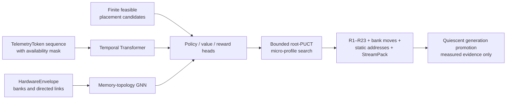

# BCIR — ML / AI Integration Roadmap

> **Companion to [`BCIR_MASTER_ROADMAP.md`](../BCIR_MASTER_ROADMAP.md).** The master owns
> portfolio order, promotion gates, and release policy; this document owns the detailed
> ML/model closure program and its research horizons. Historical Phase/CT labels are retained
> only where they identify landed programs. It does **not** redefine the spine or quarantine—it references
> them ([`BCIR_LANGREF.md`](../BCIR_LANGREF.md) §13 for L0–L3, [`HETEROGENEOUS_CHANNELS.md`](../kernel/HETEROGENEOUS_CHANNELS.md)
> for the channel model). Everything here is held to the same discipline that built the rest of BCIR:
> **prototype in the Python oracle → port to the MLIR/C law, parity-gated; learned/float stays Python and
> freezes to Q8; nothing graded ever touches the deterministic hot path.**

---

## 0. Stance — why an IR becomes intelligence

The textbook definition of an IR — *"a data structure used internally by compilers to bridge high-level source
and low-level machine code; modular, portable, optimizable"* — is operationally true and **purposeless**. It
describes features, not a reason to exist. BCIR's reason to exist is the thesis below.

**Reference State is the defining characteristic of a useful machine intelligence.** A model that only maps
inputs to outputs has no *body* — no standing relationship to the physical substrate it runs on. BCIR gives
the intelligence a body: its computational organs (the memory hierarchy CT1, the wave scheduler CT2, the
calibrated cost tables CT4, the heterogeneous channel tower) **are** the reference state. The IR is the mind's
coupling to that body. Intelligence does not float in from a dataset; it **floods in from the reference state**
when the system asks, of every program:

- *What state transformation is intended?* → the **semantic claim graph** (BCIR-0).
- *What tensors / columns / buffers / sparse maps / records / layouts exist?* → the **shaped data graph** + the
  registry (BCIR-1/2).
- *Where can resources live; what domain constraints apply?* → the **placement candidate graph** + R3/R16.
- *Which realization path π is selected under H and Θ?* → **K_BCIR** (the tropical planner).
- *What lane schedule, StreamPack, fences, prefetch contracts execute?* → **GEM**.

The graph is an intelligence **scaffold**: start from the lowest level, work with its rules (the R-laws), and
structure emerges in accordance to Landauer's Principle. The intelligence is the **feedback loop of optimization on the computational
reference state** — and that loop is the foundation we claim for all future AI built this way.

**This is deliberately not neuromorphic.** Brain-mimicking event-driven chips activate only on changing
stimuli — a poor fit for processing static, massive datasets, and a poor return against CMOS. We do not want
AI that mimics a human; we want AI that does **what humans cannot**: hold and transform vast state, deterministic
and reproducible, an *augmentation* of human intelligence — an engineered, alien ally, built from math,
programming, and optimization in feedback loops of learning and evolution. The "life-like" trait we keep is
**Reference State**, not biology.

**The logic foundation is tropical.** Intelligence here is shortest-path / most-thermal-optimal / most-efficient
pathway selection over the legal candidate DAG:

> `G` — the goal graph (a BCIR program). `π` — a realization plan (lane/stride class, batching, schedule,
> prefetch). `M(π,Θ)` — the schedule-aware price ((min,+) series ⊗, max parallel, over the wave/token DAG).
> `R(π,Θ)` — the additive 12-d resource ledger (Σ Tᵢ ⊗ fᵢ, element-wise Q8 coupling). `B(H,Θ)` — live budgets
> (thermal/power caps, Θ-dependent). Solved exactly by RCSP label dominance; Pareto-optimal plans no weight
> vector can reach recovered by `kbcir.rcsp.pareto_plans`. **All arithmetic integer/Q8 and deterministic.**

**The non-negotiables (what keeps this engineering, not dreaming).** Every layer below obeys:
1. **The two-truth quarantine** (LangRef §13, `bcir/kbcir/twotruth.py`, `verify_quarantine` R13). *Classical
   truth `v`* — binary legality (R1–R23); there is no "0.7 legal." *Graded truth `(v,w)`* — a value with
   confidence `w∈[0,1]`, the learned/measured machinery (softdp posterior, bayescal interval, regret evidence)
   that answers *which legal plan is best*, never *whether a plan is legal*. Graded may **inform** but never
   **become** a verdict; the only sanctioned crossing is an explicit `decide()` at a frozen threshold.
2. **The L0–L3 placement law.** L0 (hot path) — learned inference **prohibited**, decisions compiled out. L1
   (plan time) — frozen Q8 tables only. L2 (checkpoints) — portfolio + replay gate. L3 (meta-policy) —
   measured, human-actuated, gated by `ΔL = Σ regretᵢ/bestᵢ − (k/2)·ln(N) > 0`.
3. **Provenance is the spine.** Every decision rule in force is frozen + generation-tagged; the manifest (R13)
   is the commit hash of a plan; the memory module (`a = Lim(Res(U))`, e-graph saturation) is a frozen,
   generation-tagged extraction.
4. **Prototype-then-port + the `--fallback` / Clang-equivalence gate** — no new op ships without an
   oracle↔law↔C parity test, and BCIR never silently changes a program's observable behaviour.

Everything in §2 is an addition **under** these four laws.

---

## 1. The intelligence already in BCIR (the substrate this builds on)

This roadmap adds net-new ML capability on top of a substrate that is already an intelligence engine. The
audit (do not rebuild any of this — extend it):

**The deterministic spine (the body's reflexes).** BCIR-0..5; the claim graph; K_BCIR (`-bcir-cost-model`,
`-bcir-plan`, `-bcir-rcsp`, the min-plus shortest path + Pareto); GEM (`bcir/gem/execute.py`, the phase-ordered
wave executor); the **R1–R23** verifier law rail (with the C frontend carrying its scoped subset;
R19/R20/R21 first-class and R22/R23 covering the GEM seams). **Reusable as-is.** The
landing chronology is recorded in [`DEVELOPMENT_HISTORY.md`](../DEVELOPMENT_HISTORY.md).

**The learned organs already present (CT5, all Python, all freeze to Q8).** Each has a named growth axis —
this is what *"continuous development at every level"* means concretely:

| Organ (`bcir/kbcir/`) | Learns | Tier | Continuous-development axis |
|---|---|---|---|
| `microbench` | Q8 cost ratios (gather penalty, base overhead) | L1 | more access regimes; host thermal-noise models |
| `bayescal` | Gaussian posterior + conformal ±δ on cost | L1/L2 | ABC using `optimize` as the simulator |
| `egraph` / `memory` | liked/unliked-pair rewrites; saturated fixpoint `Lim(Res(U))` | L1/L2 | rule synthesis; saturation heuristics + budgets |
| `operad` | hierarchical labels `L`, content-addressed index `I` (FNV), trace | L1/L2 (gated) | label/index integrity; navigable provenance |
| `portfolio` | workload-class thresholds + gain schedules | L1/L2 | adaptive thresholds; class synthesis |
| `moegate` | a GNN router over the claim graph → expert selection | L2→L1 | attention heads; exploration temperature |
| `accel` | a logistic ranker for branch-and-bound candidate order | L2→L1 | feature engineering; ensemble/boosted rankers |
| `softdp` | finite-T plan posterior (free energy `−T log Σ exp(−score/T)`) | L2/L3 | annealing schedules; distillation targets |
| `regret` | hindsight regret + the MDL evidence margin `ΔL` | L3 | bandit (UCB/Thompson); cross-hardware transfer |
| `calibloop` / `throttle` | certified replan win; per-component amortization | L2/L3 | online recalibration triggers; tier-crossing budgets |
| `provenance` | manifest digest + version DAG (R13) | L2 | cross-generation plan tracing; causality |

The reasoning layers — **e-graph saturation** (the memory module, human-level "is this the same expression?"
reasoning made foundational to optimization) and the **operad** (labels/index/trace that make memory
navigable, traceable, queryable without touching the spine) — are the seeds the higher ML layers grow from.
The reference-state metrics — the **12-d cost vector**, the **thermal/power budgets**, and the recently added
**clock/timing** signal (R19/R20, `Timing` in `bcir/model/graph.py`) — are the axes the ML layers optimize over.

**The current boundary.** Tensor claims, activation/fusion, closed-set reverse-mode AD,
losses/optimizers/training, numerical-provider contracts, model ingestion, BCIRQ8, the bounded
BCIRQ4T tensor slice, and the small-Llama standalone-C gate are implemented. The optional hosted
rail also has deterministic corpus/BPE preparation and bounded SFT, reward, DPO, PPO, reasoning,
embedding, MLP, GRU, and encoder confirmation stages. These remain reference infrastructure—not
a production training framework or serving stack. Real multi-target calibration, whole-model Q4,
large-corpus training, GPU execution, and the Phase-C data/memory organs remain open.

### 1.1 Hosted model laboratory — dependency boundary and first closed gate

BCIR now has an **opt-in hosted execution layer** at [`bcir/hosted/models/`](../../bcir/hosted/models/).
It is an independent Llama-family implementation driven by `DecoderSpec`: RMSNorm, standard
half-split RoPE, GQA, causal SDPA, residuals, SwiGLU, tied/untied heads, and cross-entropy. The
package root and `bcir.hosted.models` contracts import no tensor framework; model construction,
training, and export import PyTorch only when explicitly requested. The reproducible environment
is pinned to PyTorch 2.13.0, Safetensors 0.8.0, and NumPy 2.2.6 through the `model-lab` optional
dependency. This hosted layer does not enter the verifier, dependency-free oracle, or freestanding
C runtime.

The first public boundary is deliberately small:

```python
HostedTrainSpec.from_json(text) -> HostedTrainSpec
HostedTokenSource.batch(batch_index, batch_size, context_length) -> list[list[int]]
train_hosted(spec, source, output_dir, *, device="cpu", resume_from=None,
             telemetry_sink=None) -> HostedRunReport
export_hf_checkpoint(model, output_dir, *, tokenizer_path,
                     corpus_manifest) -> ExportedCheckpoint
```

- AdamW is the only accepted optimizer. Device and precision requests are explicit; unsupported
  combinations fail instead of falling back.
- Checkpoints are pickle-free generations containing `model.safetensors`,
  `optimizer.safetensors`, `config.json`, `state.json`, and `manifest.json`. Model/optimizer
  state, data cursor, scheduler/scaler state, CPU/CUDA RNG state, dependencies, corpus/tokenizer
  identity, and every file hash are validated before destination state mutates. A sibling
  temporary generation and atomic `latest.json` replacement prevent partial publication.
- Hosted telemetry reports loss, learning rate, gradient norm, tokens, memory, and step through a
  callback. It is informative-only and cannot steer BCIR legality or an in-flight execution.
- The always-on gate trains a generated byte-tokenizer, two-layer 90,688-element tied GQA model
  for 64 one-thread CPU steps from seed 1729. It proves exact same-host resume, strict HF-style
  Safetensors re-ingest, deterministic group-32 BCIRQ8 export, learned `"abc" → "d"` generation,
  and Python-Q8/standalone-C IDs and logits (`≤1e-9`). Generated weights remain under `build/`;
  only the timestamp-free parity report is a CI artifact.

This closes a real **random weights → train → safe checkpoint → strict ingest → Q8 → C** loop. It
does not claim distributed training, a production GPU backend, or model quality beyond the
deterministic micro task.

### 1.2 Offline staged-training and compute-provider boundary

[`bcir.hosted.training`](../../bcir/hosted/training/) extends the opt-in layer without
placing PyTorch on normal BCIR imports:

- deterministic NFC/LF corpus cleaning, license admission, exact deduplication,
  content-addressed train/validation splits, and atomic JSONL publication;
- a dependency-free byte-fallback BPE reference and indexed token-source bridge;
- strict `StageTrainSpec` plus typed SFT, preference, PPO, and verified-reasoning examples;
- response-masked SFT, Bradley–Terry reward training, DPO against a frozen reference,
  token-level GAE/PPO, verified reasoning SFT, and relational embedding distillation;
- bounded MLP, GRU, and transformer-encoder confirmation models; and
- an append-only content-addressed pipeline ledger that rejects missing, reordered, or
  semantically invalid stage dependencies.

Cloud use is intentionally split into two provider-neutral interfaces. A `TeacherProvider`
returns immutable embeddings, preferences, scores, or labels; those values are frozen targets,
never a gradient channel. A `RemoteComputeProvider` executes BCIR-owned training from an attested
bundle and returns hashed BCIR-owned artifacts. The only implementations in this slice are
`RecordedTeacherProvider` and synchronous `OfflineComputeAdapter`; neither opens a network or
contains provider credentials. Live API adapters and their policy/cost tests remain future work.

The required hosted CI gate uses one CPU thread and generated fixtures. It runs tiny pretraining,
SFT, reward, DPO, PPO, reasoning, embedding distillation, and MLP/GRU/encoder training twice;
global RNG/deterministic modes must be restored and the timestamp-free reports must match exactly.
This proves machinery and objective semantics, not useful model quality.

### 1.3 Payload-free model assessment and execution-plan compilation

The first model-to-hardware planning rung is implemented in
[`frontends/models/inventory.py`](../../bcir/frontends/models/inventory.py),
[`assessment.py`](../../bcir/frontends/models/assessment.py), and
[`execution_plan.py`](../../bcir/frontends/models/execution_plan.py). The installable
`bcir-model-assess` command reads `config.json` plus the bounded Safetensors JSON headers only;
it does not hash, map, decode, quantize, or otherwise read weight payloads. Its principal typed
artifacts are:

- `TensorInventory`: exact tensor shape/dtype/role/layer, physical payload span, shard header and
  file sizes, plus a canonical header-layout digest. The digest is deliberately not presented as
  source integrity; execution still requires the checkpoint hashes from `ModelManifest`.
- `HardwareEnvelope`: explicit banks, allocatable capacity, domains/channels, directed links, and
  bounded prefill/decode benchmark evidence. No RAM/VRAM capacity or GPU capability is guessed.
- `ModelWorkloadSpec`: inference, LoRA, full-finetune, or pretraining shape, sessions/batch/context,
  dtypes, optimizer state, checkpointing, and requested formats.
- `ModelCostReport`: byte-exact source/BCIRQ8-group-32 format sizes, KV cache, the fused-decoder
  workspace contract, gradients/optimizer/master/adapter state, and per-bank peak memory for every
  resident, double-buffered layer-streaming, and contiguous host/device split candidate.
- `ModelExecutionPlan`: the selected report/candidate identity and explicit move, prefetch,
  compute, barrier, and eviction sequence; compute blocks carry their dense Llama operation count
  separately from the bytes they touch. The lowering must pass module/plan/lifetime/bank-move/
  StreamPack verification before the canonical JSON and StreamPack bytes receive their hashes.

Kernel evidence is fail-closed. The portable `model_microbench.py` helper runs hard-bounded
prefill-like matmul and decode-like matvec references (`dimension ≤ 64`, `repeats ≤ 15`) and emits
an empirical lower/median/upper interval. It is a local CPU reference floor, not GPU evidence;
vendor/device channels require measurements from the actual target. Predictions use only
matching operation/channel/format records, conservatively scale their operation, weight-byte,
and workspace envelopes, price both sides of a host/device split plus its directed transfer, and
report fixed-point tokens/second intervals rather than a fabricated point estimate. Artifact and
search limits are explicit (32 banks, 4,096
layers, and 100,000 placement candidates); larger descriptions must be partitioned intentionally
instead of exhausting a planning host.

The execution classification is semantic: source-format plans are `exact`, BCIRQ8 plans are
`quantized`, and `approximate` is reserved for a future explicitly admitted pruning/distillation
contract. Exact physical inventory works for every supported Safetensors dtype, but executable
cost/placement plans currently require the strict canonical Llama/GQA tensor census and a source
dtype accepted by BCIR's decoder; other architectures remain explicit refused reports. “Layer
streaming” partitions storage/execution of one model; it does not falsely turn
layers into independent language agents or preserve training quality by itself. The current rail
produces inference plans with separate prefill/decode templates; each repeat applies to the whole
ordered template, so autoregressive decode cannot repeat an individual layer or transfer out of
token order. Training
workloads receive exact capacity/state reports but are refused at plan lowering until optimizer,
gradient, and rematerialization actions have their own verified claim contract. The rail does not
load the planned weights, execute a GPU kernel, or emit a new quantized artifact. Tests use
canonical toy Llama headers, a virtual 1-TiB synthetic
header, a virtual 4.5B-parameter Llama header that must choose a verified layer-streaming plan,
and the existing 90,688-parameter hosted checkpoint; none allocates those synthetic weights or
performs large inference.

Example:

```bash
bcir-model-assess MODEL_DIR \
  --hardware hardware-envelope.json --workload workload.json \
  --inventory-out build/model-plan/inventory.json \
  --report-out build/model-plan/cost-report.json \
  --plan-out build/model-plan/plan.json \
  --pack-out build/model-plan/plan.bspk
```

### 1.4 First hardware-RL policy and exact tensor-address planner

BCIR now has a bounded first reinforcement-learning system for hardware-plan selection. It
composes existing model assessment, telemetry, K_BCIR, verification, and StreamPack machinery;
it does not introduce a second legality or execution system:



The dependency-free contracts live in
[`bcir/kbcir/hardware_rl.py`](../../bcir/kbcir/hardware_rl.py). `TelemetryToken` distinguishes
an unavailable register/bandwidth/throttle signal from a real zero with an explicit mask;
`HardwareTopology` encodes bank nodes and directed links; `CandidateFeature` retains ordered
compute-bank and backing-bank identity; and `HardwareOutcome` carries correctness, sample count,
source hash, and `measured` or `simulated` provenance. `HardwareRewardPolicy` maps latency,
energy, cache-miss/bandwidth pressure, thermal pressure, throttling, and register contention into the existing
12-dimensional integer K_BCIR cost vector. Lower cost creates preference pairs; it never changes
legality.

The optional model in
[`bcir/hosted/training/hardware_policy.py`](../../bcir/hosted/training/hardware_policy.py) is a
small GNN/Transformer with policy, value, and reward heads. Its bounded trainer performs three
explicit phases:

1. regress normalized utilities derived from exact recorded metrics;
2. optimize metric-derived chosen/rejected pairs against a frozen reference (DPO); and
3. run a clipped offline PPO-style update over the best verified candidate in each episode.

It exports only Safetensors plus strict configuration, report, and file-hash manifests into a
content-addressed directory. Training restores the caller's RNG and deterministic-algorithm mode;
normal `bcir` and contract imports remain PyTorch-free. The always-on Ubuntu/Windows hosted gate
uses one CPU thread, a 32-wide model, six generated stress episodes, six assessed model-placement
shapes, and 288 tiny updates. It trains twice, requires identical artifacts, learns all six exact
metric winners, drives one winner through bounded PUCT, claims, StreamPack, and static-memory
verification, and records a timestamp-free report. It downloads no model and performs no GPU or
large-model work.

[`bcir/kbcir/static_memory.py`](../../bcir/kbcir/static_memory.py) supplies the non-learned memory
authority. It derives each resource's phase lifetime, assigns an aligned byte offset in its named
bank, reuses an address only after the prior resource dies, checks allocatable capacity, and emits
a content-addressed `StaticMemoryPlan`. An independent verifier rechecks the resource census,
module/hardware identity, sizes, alignments, lifetimes, bounds, bank summaries, and every
simultaneously-live alias pair. Model lowering now preserves an explicit RID→bank binding, so the
same move/prefetch/compute/barrier/evict program has an exact address plan.

The promotion boundary is intentionally narrower than the model. A simulator may train and test a
policy, but `certify_hardware_promotion` accepts only correctness-passing **measured** selected and
baseline outcomes, a strict policy-weighted improvement, a fully reverified plan/StreamPack/static
layout, and a quiescent generation boundary. There is no in-flight model steering or hot-swap.
The current micro gate therefore ends with `withheld:simulated-evidence` by design.

Research informs this shape without becoming a performance claim:

| Primary result | BCIR use | Boundary retained |
|---|---|---|
| [AlphaDev](https://www.nature.com/articles/s41586-023-06004-9) | finite policy/search game with an external correctness oracle | no unrestricted assembly generation; a future sort/hash game needs a closed ISA vocabulary, sandbox, machine-code validator, and exhaustive/differential functional tests |
| [Checkmate](https://proceedings.mlsys.org/paper_files/paper/2020/hash/0b816ae8f06f8dd3543dc3d9ef196cab-Abstract.html), [DTR](https://arxiv.org/abs/2006.09616), and [MemoMalloc](https://arxiv.org/abs/2203.00448) | exact lifetime/address planning now; rematerialization/spill policy next | v1 is static resource-level phase liveness, not predictive runtime rematerialization or semantic swap |
| [Transferable Graph Optimizers](https://proceedings.neurips.cc/paper_files/paper/2020/hash/9f29450d2eb58feb555078bdefe28aa5-Abstract.html) | GNN topology plus temporal/candidate context | current evidence is a generated micro fixture, not transfer across physical targets |
| [TVM](https://arxiv.org/abs/1802.04799), [Ansor](https://www.usenix.org/conference/osdi20/presentation/zheng), and [MLGO](https://llvm.org/docs/MLGO.html) | learned ranking reduces a bounded measured search | measured hardware remains the oracle and compiler legality remains independent |
| [DPO](https://arxiv.org/abs/2305.18290) | exact hardware metrics produce deterministic preference pairs | no human-preference or frontier-model score substitutes for counters |
| [FlexGen](https://arxiv.org/abs/2303.06865) and [PagedAttention](https://arxiv.org/abs/2309.06180) | future tiered tensor/KV placement | no current CPU/GPU/disk offload runtime or paged-KV allocator is claimed |

The next evidence steps are ordered: replay real CPU episodes; add driver-proven register,
bandwidth, energy, and throttle providers; compare policy-guided search with exhaustive candidates;
add checkpoint/rematerialize/spill actions to the verified vocabulary; qualify two physical
targets; then consider a lightweight draft policy. A larger background policy may prepare a next
generation, but activation remains at a quiescent boundary with rollback. Full HAM materialization,
semantic swap, live GPU register allocation, and AlphaDev-style sorting/hashing assembly games are
separate future slices.

### 1.5 CUDA-LLM findings and the BCIR-owned 32M program

The external [`MagicCoding2006/CUDA-LLM`](https://github.com/MagicCoding2006/CUDA-LLM/tree/7813ea500098b7a49871492ef2e4ec1fef6dfeab)
assessment showed a valuable compact system shape: from-scratch pretraining/SFT, memory-aware
execution, tiled and sliding-window attention, static KV caches, CUDA graphs, low-bit inference,
bounded serving, RAG, and operational metrics. Its live model-health endpoint reported six
FP16/INT8/INT4 eager/fast variants at deployed commit
`632e83514205ad17904593e7becbf984665b4ae2` when checked on 2026-07-17. The source repository had
no declared license and no immutable public checkpoint suitable for BCIR redistribution, so no
source or weights are copied.

| Adopt independently now | Adapt after measurement | Exclude from BCIR |
|---|---|---|
| Hosted Llama training, SDPA reference, gradient accumulation/checkpointing, exact safe resume, informative metrics | Request-isolated static KV/CUDA graphs, verified BCIRQ8 GPU kernels, then a separately specified BCIRQ4, bounded serving and optional RAG | External code/weights, mutable datasets, pickle-only checkpoints, silent backend fallback, scalar CUDA kernels as the canonical backend |

The follow-on owned model is **BCIR-TinyStories-32M**. Its landed specification is
[`tools/models/configs/bcir-tinystories-32m.json`](../../tools/models/configs/bcir-tinystories-32m.json):
31,203,840 parameters; vocabulary 16,384; width 512; eight layers; eight query/four KV heads;
FFN 1,344; tied embeddings; SwiGLU; context 512; no dropout. The immutable dataset inventory is
[`tools/models/tinystories_pins.json`](../../tools/models/tinystories_pins.json): TinyStories
revision `f54c09fd23315a6f9c86f9dc80f725de7d8f9c64`, four ordered train shards, a separate
validation shard, five exact SHA-256 values, and the CDLA-Sharing-1.0 notice.

The next slices are ordered and not yet claimed as landed:

1. Train a 16,384-piece SentencePiece 0.2.2 BPE with byte fallback from the pinned train split.
   Freeze the identity-normalization and whitespace contract, then differentially prove the
   dependency-free BCIR tokenizer reproduces it before accepting the tokenizer.
2. Run bounded local FP16 pilots only. The canonical A10-class BF16 run uses 32,768 effective
   tokens/update, 19,532 updates (640,024,576 tokens), AdamW `(0.9, 0.95)`, peak LR `3e-4`, 500
   warmup steps, cosine decay to `3e-5`, weight decay `0.1`, clipping `1.0`, and activation
   checkpointing. The local GTX 1660 SUPER is not the canonical training rig.
3. Establish SDPA CPU/GPU parity, then static KV and CUDA-graph decode, then a BCIRQ8-native GPU
   kernel. Add packed BCIRQ4 only under its own wire contract and quality/parity report; custom
   attention must beat SDPA in a reproducible measurement before promotion.
4. Keep serving outside the core with bounded admission/output queues, deadlines, cancellation,
   request-owned cache generations, paged-KV/continuous batching, and registry-backed telemetry.
   Retrieved RAG text remains untrusted input.
5. Publish only reviewed model, tokenizer, provenance, evaluation, and Q8 artifacts in
   `Mecca-Research/BCIR-Models` under BCIR-NC terms with the TinyStories/CDLA notices and a
   reproduction container.

---

## 2. The ordered build-out

Six phases, dependency-ordered. The through-line: **a verifiable C inference substrate → ML primitives over
it → data/memory organs to feed them → more language sources → ML-guided hardware deployment → higher
cognition.** Each phase states what it *builds on*, its *L0–L3 / two-truth placement*, and its *parity gate*.
Phases A–B contain landed foundations plus bounded closure work; E–F are horizons. ML work
runs with bounded resources under [`BCIR_MASTER_ROADMAP.md`](../BCIR_MASTER_ROADMAP.md)
§4.4 and must not block the telemetry→UART→virtio driver dependency chain.

### Phase A — The C inference substrate
*C is both a driver-oriented frontend and a portable inference realization. It remains a
documented subset and uses resident toolchains/libraries where appropriate; “portable C” is
not a claim of unrestricted language coverage or automatic hardware-optimal code.*

- **A1 — Max out C23 as the inference pathway.** **Landed:** `#embed`, atomics, alignment, `typeof`/`_Generic`,
  VLAs, bitfields, `_Complex`, aggregate initialization, statement expressions, exact-width `_BitInt(N)`, and
  `[[unsequenced]]` / `[[reproducible]]` as a fusion-legality signal. Per-group power-of-two quantization and
  the fixed BCIRQ8 group-32 artifact prove the Q8 storage/reference path. BCIRQ4T v1 adds a
  deterministic signed-Q4 tensor wire contract, strict CRC/extent checks, a portable C Q4×Q8 twin,
  an AVX2 packed-nibble `vpmaddwd` path, power-of-two SmoothQuant calibration, and explicit FP32
  outlier residuals. **Remaining:** whole-decoder Q4 and model-level drift/NLL gates; ARM and other
  target-specific packed compute; additional microscaling/FP8/NF4/GGUF-style adapters under explicit
  R17 contracts; `<stdbit.h>` and
  `<stdckdint.h>`; verifier-fed `assume`; and native decimal-float semantics rather than recognition/fallback.
- **A2 — Native matrix/tensor abstractions + safe-pointer polymorphism.** Build a first-class matrix/vector
  type for the C subset (over the existing multi-dim array + aggregate lowering) and use the **extent-provenance
  pointer model** (the `masked`/`assumed_safe` decision in LangRef §4) to give *polymorphism without errors*: a typed,
  bounds-recoverable pointer is the safe substrate for "C that reads like assembly, with automatic safety."
- **A3 — The test → quarantine → study → fix → optimize loop (the first practical CS layer).** Wire the
  natural debugging layers into ML + optimization: the runtime quarantine (`BCIR_CHK` / `bcir_bounds_quarantine`)
  + the three-way differential fuzzer (`tools/c/fuzz_cfront.py`) + the **regret ledger** become an *error-handling
  policy* — detect → quarantine → study (root-cause via the differential shrinker) → fix → re-optimize, with the
  policy chosen per computational environment. Lives L3 (observational) → frozen L1 policy.
- **A4 — Macro Assembly Programming for memory consolidation.** Extend the MAP frontend (CT3) + the allocator
  pool-plan (`-bcir-alloc-pool`, liveness arenas) with low-level ML so thousands of lines of hand-allocation
  collapse into engine-optimized, pool-planned claims.

### Phase B — The ML primitive layer (tensor ops as claims) — *this is Phase M, deepened*
*Builds on Phase A + the K_BCIR search + the operad/e-graph. Prototype each op in the oracle, port to an MLIR
law, parity-gate. Throttled, parallel to C/driver work.*

- **B1 — Tensor ops as BCIR claims.** **Landed:** `gem.matmul` / `gem.conv` / `gem.attention` carry geometry,
  precision, and cost metadata; R22/R23 enforce shape/dtype seams; `plan_matmul` searches tile and loop-order
  candidates deterministically. The planner is explicitly **dual-semiring**: (min,+) composes/selects plans
  while `max(compute,memory)` models the binding roofline. A stable schedule artifact records analytic
  and bounded measured candidates, OS/optional PMU counters, derived fixed-point constants, target
  identity, and separate GEMM/fused/attention workload classes; it exports the selected
  `bcir.gem.matmul_buffer` schedule to MLIR. **Remaining:** exhaustive measured comparison on at least
  two real targets and integration into a target transform/promotion workflow. The target is a
  reproducible near-peak schedule, not an unbounded runtime autotuner.
- **B2 — Activation specialization + fusion.** Activations fuse with the producing op via the **existing bundle/
  fusion/deforestation optimizer** — no new fusion engine, just new fusible ops.
- **B3 — Gradient machinery as graph transformations.** **Landed:** first-order reverse-mode AD is a
  content-addressed closed DAG, gradients are local graph rewrites, closure is machine-checked, symbolic
  reverse-over-reverse covers the closed vocabulary, and `bcir.gem.autodiff` carries the law object.
  The vocabulary includes exp/log/sqrt/tanh/sin/cos with Python/C/MLIR parity. A measured ordering
  report selects differentiate-high/optimize-low; bounded rematerialization, local scalar mutation
  functionalization, traced budgeted loops, and finite call-table defunctionalization are implemented.
  Use the literature-backed terminology **monoidal/string-diagram (PROP) rewriting**; do not describe
  AD as operad 2-cells. **Remaining:** qualify the ordering and rematerialization policy on representative
  model graphs; aliased mutation, recursion, unbounded loops, and dynamic higher-order calls remain
  explicit quarantines unless a future closed representation is proven.
  - **Landed so far — the M/E build record.** The Phase-B ML substrate below is **BUILT**: each slice an
    oracle-first, parity-gated, PR-sized landing, all **off the legality path** (no verifier touched, no
    `Diagnostic` emitted), pure-Python oracle + emitted-C twins gated in `tools/c/check_runtime.sh`,
    deterministic given the seed. The per-slice build narratives are summarized in
    [`DEVELOPMENT_HISTORY.md`](../DEVELOPMENT_HISTORY.md); the definitive detail is the code + tests.

    | Slice | What shipped | Where |
    |---|---|---|
    | B3 Phase 1 | Reverse-mode autodiff as content-addressed rewrites over a **closed primitive set** `{const, var, neg, add, sub, mul, div, dot, select, exp, log, sqrt, tanh, sin, cos}`, the closure **machine-proven** (no adjoint rule ever emits a foreign op, so reverse-over-reverse stays in-vocabulary — the canonical-form property the `gem.autodiff` law op relies on) | `bcir/kbcir/autodiff.py`, `bcir/tests/test_autodiff_closure.py` |
    | M1 | The loss head: closed-set MSE built into the `Tape`; transcendental losses (softmax-CE, BCE-with-logits, hinge) return closed-form **gradient seeds** so a parameter gradient never carries a transcendental | `bcir/kbcir/losses.py` |
    | M2 | Adaptive optimizers — momentum, RMSprop, Adam (bias-corrected) — as a side-effect-free reference oracle + emitted C steps (RMSprop/Adam ride the trusted libm `sqrtf` edge; SGD/momentum are pure arithmetic) | `bcir/lower/optimizers.py` |
    | M3 | The epoch / mini-batch training loop (deterministic LCG shuffle, train/val split, metrics, early stop) — **the Tier-1 trio (M1–M3) is complete: BCIR trains logistic regression and a small MLP end-to-end** | `bcir/kbcir/training.py` |
    | E1 / E2 | OLS + PCA on the Area-B "integrate, don't reinvent" wrap pattern (LAPACK `sgels` / `ssyev` when linked, portable normal-equations / Jacobi fallbacks, independent optimality/eigen verifiers, R17 input bridges) | `bcir/kbcir/ols.py`, `bcir/kbcir/pca.py` |
    | E3 | A full Transformer encoder block (multi-head, batched, causal-masked, POST-/PRE-LN) **composed** from the existing attention/softmax/matmul references; LayerNorm is the one net-new primitive | `bcir/kbcir/transformer.py` |
    | E4 | RNN / LSTM / GRU — a two-tier design forced by the autodiff closure: a closed-set relu-RNN trainable end-to-end via the existing `unroll_scan` + `grad` (literal BPTT, finite-difference-verified), and LSTM/GRU cells with closed-form gate gradients on the libm edge | `bcir/kbcir/recurrent.py` |
    | E5 | Classical-ML **PREDICT** wraps (KNN / decision tree / SVM / Gaussian-NB) — **the train-vs-predict research finding E7 cites**: training (tree induction, the SVM dual QP, NB fitting) is iterative/combinatorial and stays library/Python-side; predict over a **baked** model is the fixed-shape G5 kernel pattern BCIR owns | `bcir/kbcir/classical.py` |
    | E6 | Unsupervised + the data pipeline: K-means (deterministic Lloyd, exact assign kernel), Standard/MinMax scalers, CV folds, an autoencoder, embedding lookup — all reusing E5/M1/M3 pieces | `bcir/kbcir/unsupervised.py` |
    | E7 | The language-placement **capstone**: every ML/numeric component classified into the Python / C / MLIR / C++ hierarchy by five criteria (two-truth, train-vs-predict, exact-vs-transcendental, planned-claim cost, the C++ boundary) | [`ML_LANGUAGE_PLACEMENT_ANALYSIS.md`](ML_LANGUAGE_PLACEMENT_ANALYSIS.md) |
- **B4 — Hybrid tropical + selective gradient.** Reframe training: the **tropical planner finds the structure**
  (layout, schedule, fusion — exact, deterministic), **gradient steps tune the weights** (graded side). Many
  training problems become tropical optimization + a few gradient steps. `softdp` (the finite-T posterior) and
  the `regret` ledger are the learned guidance — always graded, never on L0.
- **B5 — Integrate existing C numerical libraries as intrinsics (do NOT rebuild XLA/TF).** **Core breadth is
  landed:** CBLAS, FFTW 1-D/2-D, LAPACK, GSL, SLEEF, and libcerf wrappers share the `c.call.libm:` trust edge,
  automatic platform-aware link classification, R17 bridges, portable fallbacks, numerical red-team tests, and
  calling-side layout/tile/prefetch/channel planning. A workload-scoped provider registry probes only
  requested capabilities, records bounded OS/optional PMU measurements, chooses only measured providers,
  and emits deterministic evidence while remaining legality-independent. Further libraries are
  demand-driven; the remaining proof is performance and availability on target systems, not another
  parallel numerical framework.

### Phase C — Data + memory organs (feeding the ML) — *extends CT1 / CT3*
*Builds on the ETL/binary-record frontends, the telemetry ring, the memory-tier cost model,
and the landed per-bank static address planner. Dynamic storage, persistent HAM, and
rematerialization/spill execution remain to be materialized here.*

- **C1 — Tabular streaming → tensor ops.** Remodel a **FreeTDS**-style row source into a column-oriented
  streaming buffer; streamed rows become a tensor stream over `!bcir.token` + GEM waves — *accelerated* tabular
  learning instead of sequential epochs. Reuses the binary-record decoder + the telemetry ring; net-new: the
  column buffer + windowed-aggregate ops.
- **C2 — The BCIR vector database.** **Materialize the HAM** O(log n) cost abstraction into a real hierarchical
  index (today HAM is priced but never allocated), persisted through **HDF5** + **LMDB**, with embeddings from
  Phase B. The **content-addressed operad index** (the FNV fingerprint) is the natural vector key — CSE and the
  liked-pair identity `a = a` give dedup and reproducibility for free. Combine with the existing memory tiers
  (L1..SSD/CXL) so hot vectors promote and cold vectors demote under the same cost model.
- **C3 — Cloud deployment.** Promote the telemetry **ring → a real Kafka producer** (net-new C; the Python
  abstraction exists); use **Zarr** chunked arrays as the StreamPack-friendly tensor-on-disk format; target
  **WASM** as a channel for portable deployment. *Assess vs alternatives* (Arrow/Parquet for columnar; Arrow
  Flight vs Kafka for transport) before committing — the StreamPack ABI and the channel model are the fixed
  points.
- **C4 — Predictive tensor residency.** **Landed baseline:** exact phase-lifetime address reuse,
  capacity/alignment/alias verification, and model-plan RID→bank bindings. **Remaining:** verified
  checkpoint/rematerialize/spill/prefetch actions, bounded online eviction policy, request-owned KV
  generations, host/device transfer execution, OOM forecasting, and replay against real counters.
  A learned policy may rank these actions; the static verifier and memory-capacity proof admit them.

### Phase D — Language reach (more goal-graph sources) — *extends Phase F*
- **D1 — Fortran, immediate: GCC/Flang fallback.** Compile Fortran with Flang/GCC → object/static lib; BCIR
  **calls it via the standard ABI / `ISO_C_BINDING`** over the existing `c.call` + `--fallback` seam, and
  optimizes the *calling* side (layout, prefetch, fusion). No Fortran frontend required to get value.
- **D2 — Fortran, later: selective deep integration.** Treat only the high-value subsets as **BCIR intrinsics /
  specialized ops** (the same pattern as B5): Fortran array sections, intrinsic math, BLAS/LAPACK-shaped kernels,
  and HPC `do` loops with known trip counts over contiguous arrays. Not a full language frontend — targeted
  intrinsics. (C++ and the Python lifter remain master-roadmap Phase F.)

### Phase E — Hardware-native deployment (the body's organs) — *this is master-roadmap Phase D, now ML-guided*
*Deliberately after Phase B: drivers and JIT microkernels are far more powerful once the ML layer can guide
them (thermal/power/clock optimization, adaptive unrolling, best-ISA selection).*

- **E1 — JIT kernels + ML-guided code generation.** Wire **Intel IPP** (and equivalents) as channel-backed JIT
  kernels; the **calibration loop + `moegate` router + telemetry** make data-driven choices of vector
  instruction set, cache-tiling strategy, register file, execution unit, and clock — *learning over time* which
  combination gives the best energy/performance on the current silicon (the recursive-intelligence seed). Extends
  naturally to thermal derating, power-domain decisions, adaptive unrolling. **First bounded slice
  landed:** the GNN/Transformer hardware policy ranks finite model-placement candidates and feeds
  bounded PUCT, but its CI evidence is simulated and cannot activate a live plan. Real PMU/device
  episodes, frozen deployment weights, two-target qualification, and driver lifecycle integration
  remain required.
- **E2 — ML SMBIOS/UEFI boot + the kernel triage.** Build the boot/discovery layer **before** drivers: SMBIOS +
  UEFI feed the **`channel.json` profile** (the reference-state bootstrap — the body learning its own organs);
  ML decides boot/driver configuration. Explicitly plan the **Linux-master-kernel ABI/IPC triage**: which ABI
  and inter-process-communication contracts to keep vs re-derive through BCIR.
- **E3 — Drivers / JIT microkernels (ML-guided).** The `drivers/` JIT generator + per-channel resident drivers
  (master-roadmap Phase D), now consuming the ML guidance from E1 to give each hardware **channel** its real,
  measured-calibrated driver. Closes the heterogeneous-tower loop (FPGA/NVMe/HBM-PIM become driver-backed).

### Phase F — Higher cognition (NLP + recursive intelligence) — *extends Phase L*
*The payoff layer, on top of compilers + kernels + the ML library.*

- **F1 — The NLP base: a deterministic token generator.** After codegen is solid, pair an **ML FreeType**
  interface with the **Unicode database** as the base tokenizer: glyph/grapheme/codepoint structure → tokens,
  with the **operad content-addressed index** as the stable token fingerprint (reproducible, CSE-friendly). This
  is the substrate for an NLP system that inherits BCIR's determinism + provenance.
- **F2 — The file-creation backbone.** Keep object/file production on the resident
  ELF/DWARF/BFD/LLVM ecosystem behind
  [`BCIR_NATIVE_OBJECT_GATE.md`](../BCIR_NATIVE_OBJECT_GATE.md). BCIR may plan section
  placement or artifact policy, but it adopts a library only for a concrete consumer and
  does not pre-commit to a native object writer.
- **F3 — Recursive intelligence (the capstone).** The L3 meta-policy loop closes **on itself**: the regret
  ledger + the `ΔL` trigger applied to the *optimizer's own* policies, so the system self-optimizes its
  optimization strategies — the point where genuine reference-state self-understanding emerges. It stays **L3,
  graded, human-actuated** by the quarantine: the system *recommends* changes to itself; a human (or a frozen,
  replay-certified gate) actuates. No recursion is ever allowed onto the L0 hot path.

---

## 3. The continuous-development discipline (how every layer keeps evolving)

This is the engineering method that makes "continuous development at every level" real rather than aspirational.
Every new ML capability in §2 obeys it:

1. **Place it on the L0–L3 ladder first.** Where does the *training* live (L2/L3, float, Python)? What *freezes
   to Q8* (the deployed artifact)? What, if anything, crosses to L1 (a frozen table) — and never to L0. SGD,
   autodiff, and posterior inference are L2/L3 graded machinery; only their frozen Q8 outputs deploy.
2. **Prototype in the oracle, then port to the law.** A tensor op, a gradient rewrite, a new R-law — first a
   Python oracle prototype (cheap iteration, the conformance reference), then the MLIR/C++ law and/or the C
   twin, gated by an oracle↔law↔C parity test. The oracle then **freezes** (the
   prototype-then-port discipline in [`BCIR_MASTER_ROADMAP.md`](../BCIR_MASTER_ROADMAP.md)
   §1 and its publication gate in §7).
3. **Close the provenance/regret feedback loop.** Measure (telemetry ring) → book regret (`ΔL`) → recalibrate
   (`calibloop`) → re-freeze a generation-tagged table → R13 manifest. This loop *is* the continuous-development
   engine; every organ in §1 plugs its growth axis into it.
4. **Hold the two-truth invariant.** A new capability may produce graded `(v,w)` guidance, but legality stays
   classical (the R-laws + `verify_quarantine`). A confidence never becomes a verdict; a diagnostic never
   carries a confidence.

---

## 4. Capability-track placement (do we need CT6 / CT7?)

The ideas in §2 mostly extend existing tracks: **CT1** (memory) gains the materialized HAM + the vector DB
(C2) and the tensor-on-disk formats (C3); **CT3** (frontends) gains tabular streaming (C1), the Fortran seam
(D), and the FreeType/Unicode tokenizer (F1); **CT4** (calibration) gains the ML-guided JIT loop (E1); **CT5**
(learning) gains gradient machinery (B3) and the recursive meta-policy (F3). The former CT6/CT7 proposal is
retained only as a useful grouping, not as a new global numbering program:

- **CT6 — ML primitives.** Tensor/gradient/training ops as first-class claim-graph + cost-model citizens
  (B1–B4), with their own R-laws (shape/dtype/accuracy).
- **CT7 — Data & persistence organs.** Streaming sources, the vector DB, and the cloud transport (C1–C3) as a
  named track distinct from the static ETL frontends.

Recommendation: do not add new global CT numbers merely to rename landed tensor work.
Keep ML primitives in this roadmap and create a data/persistence workstream only when a
materialized store has two real consumers and a measured contract.

---

## 5. Risk register / honest boundaries (out of the dreamy potentials)

- **Substrate–intelligence inversion.** A rich learned/tensor stack over targets whose
  device-specific performance is often still modeled rather than measured (master roadmap
  §4.4). *Mitigation:* every tensor op is
  held to the **same Clang-equivalence + measured-replan gate** as the rest of BCIR; ML ops are throttled and
  never block the keystone; the quarantine keeps the learned side off L0.
- **"Don't rebuild XLA/TensorFlow."** The discipline is **integrate, don't reinvent** —
  the landed CBLAS/FFTW/LAPACK/GSL/SLEEF/libcerf families establish the trusted-library
  seam; add providers only for measured workloads and win on the *calling side*.
- **Float is scoped, not denied.** Reference/training and explicitly declared numerical
  kernels may use float. Learned planning policy freezes to deterministic Q8/integer
  artifacts before L1/L0; R17 and parity bound the numerical crossing.
- **Neuromorphic is explicitly rejected.** The reference-state-optimization approach on CMOS, not event-driven
  biological mimicry, is the bet. The "life-like" trait is Reference State, not spiking.
- **Near-term vs vision.** The initial A1/B1/B3/B5 and M1–M3 slices have landed. Near-term work is the bounded
  completion register below plus Phase C data/memory materialization and the serving gaps in §7. F1–F3 remain
  horizons; their presence records dependency order, not implementation status.

---

## 6. AI-substrate closure register

The 2026-06-27 SOTA scan has been retired after checking every design implication against source and tests.
Its completed work is recorded in [`DEVELOPMENT_HISTORY.md`](../DEVELOPMENT_HISTORY.md); this table is the
canonical home for the obligations that remain.

| Track | Source-backed state | Remaining acceptance work |
|---|---|---|
| **A1 quantization** | BCIRQ8 plus BCIRQ4T v1 signed-Q4 storage, CRC/extent checks, power-of-two scales, SmoothQuant/outlier calibration, portable C Q4×Q8, AVX2 packed compute, and explicit format-admission evidence are landed | Extend the tensor slice to whole-decoder Q4 with compactness/drift/NLL gates; qualify ARM and additional targets; implement MX/FP8/NF4/GGUF-style formats only with independent provenance and quality contracts |
| **B1 scheduling** | Deterministic search plus a stable artifact records analytic/measured candidates, real OS/optional PMU counters, target fingerprints, derived constants, regret, separate GEMM/fused/attention classes, and selected-schedule MLIR | Run bounded exhaustive comparisons on at least two real targets, publish GEMM versus fused/attention evidence separately, and integrate reviewed artifacts into target promotion/transform application |
| **B3 autodiff** | The closed set includes arithmetic, select/dot, and six transcendentals; Python/C/MLIR parity, measured AD ordering, differentiate-high/optimize-low selection, rematerialization, local mutation functionalization, bounded dynamic-loop tracing, and finite call tables are landed | Qualify ordering/rematerialization on representative model graphs; keep aliased mutation, unbounded loops, recursion, and dynamic higher-order calls quarantined until a replayable closed representation exists |
| **B5 numerical libraries** | Existing six library families now sit behind workload/dtype descriptors, demand-driven probes, bounded real-counter measurements, measured selection, and deterministic legality-independent evidence | Collect and review linked-library availability/performance artifacts on supported CPU/accelerator hosts; add providers only for demonstrated workloads |
| **Hardware RL / memory** | Availability-aware telemetry tokens, bank/link graph encoding, ordered placement features, K_BCIR metric rewards, reward/DPO/PPO micro training, bounded PUCT, exact static addresses, StreamPack lowering, and measured-only quiescent promotion are landed | Gather real CPU/GPU/driver episodes, add verified rematerialize/spill/KV actions, compare against exhaustive search on two targets, freeze a deployment artifact, and build any assembly game only behind ISA and functional-oracle gates |

Research basis retained from the retired scan: SmoothQuant (`arXiv:2211.10438`), OCP microscaling
(`arXiv:2310.10537`), QLoRA/NF4 (`arXiv:2305.14314`), and the INT-vs-FP hardware analysis
(`arXiv:2303.17951`) bound A1's open formats; Warpspeed (`arXiv:2204.14242`), tritonBLAS
(`arXiv:2512.04226`), and the portability/autotuning counterpoint (`arXiv:2505.03780`) bound B1's claims;
Enzyme (`arXiv:2010.01709`), reverse-mode decomposition (`arXiv:2105.09469`), and functorial string-diagram
rewriting (`arXiv:2107.13433`) bound B3's terminology and performance risk. These are design evidence, not
normative laws or promised performance.

The local reference slices are now present. Acceptance proceeds by evidence: **whole-model/multi-target
A1 → two-target B1 measurements → representative-graph B3 qualification → host/accelerator B5
inventories**, with C1 data streaming able to proceed in parallel. Each promotion remains oracle-first,
parity-gated, bounded, and outside L0 until frozen into a certified artifact.

---

## 7. Open-weight model ingestion (GLM / Gemma / Qwen) — the LLM-serving horizon

> Moved here from `OPENAI_BCIR_INTEGRATION_RESEARCH.md` (which now covers only the OpenAI
> product-surface integration): open weights are an **ML/AI-substrate** program, not an OpenAI
> integration. They change the problem from "GPT as a remote teacher" to "the model is an artifact
> BCIR may own, inspect, quantize, place, and serve." BCIR is conceptually well suited to this —
> its core job is turning a semantic computation into a legal, costed, target-aware realization
> with telemetry and replay. BCIR now has a real small-Llama manifest/tokenizer/checkpoint
> ingest → float decode → BCIRQ8 → standalone-C greedy parity gate. This section therefore
> owns the gap between that bounded reference and a production multi-model serving/training
> system; it must not describe already-landed ingestion or decode as missing.

### 7.1 Model-family fit

| Open-weight family | Fit for BCIR now | Why | Main difficulty |
|---|---|---|---|
| GLM-5.2-class heavy models | Research / cluster-scale target | Strong open-weight coding/agent model; useful as a local teacher or high-end endpoint if the deployment stack already exists | Very large memory/KV-cache, tensor/expert parallelism, long-context attention, production scheduler, tokenizer/checkpoint compatibility, safety and license review |
| Gemma 4-class models | Best practical first target | Open weights for responsible commercial use; positioned for advanced reasoning/agentic workloads and optimized deployment across hardware classes | Exact tokenizer, weight-layout importer, attention/RoPE/norm kernels, quantization and eval harness |
| Qwen open-weight models | Practical first/second target, especially coder/agent variants | Widely used open-weight coding/reasoning models with deployment recipes; smaller dense/MoE variants realistic for local or hosted BCIR endpoints | Architecture variants, chat templates, tokenizer edge cases, MoE/expert routing, license/version matrix |

The small dense proof is complete with the pinned TinyLlama gate. The next model must be
selected to close a measured architectural or deployment gap—rather than for family name—after
sampling, serving/eval, and device placement are ready. Cluster-scale and MoE families remain
blocked on sharding, expert/tensor parallelism, production scheduling, and hardware evidence.

Sources: GLM-5.2 announcement (<https://z.ai/blog/glm-5.2>), GLM-5 repository
(<https://github.com/zai-org/GLM-5>), Gemma 4 model overview (<https://ai.google.dev/gemma/docs/core>),
Google DeepMind Gemma 4 page (<https://deepmind.google/models/gemma/gemma-4/>), Gemma open-weight
library (<https://github.com/google-deepmind/gemma>), Qwen3 announcement
(<https://qwenlm.github.io/blog/qwen3/>), Qwen3.5 announcement (<https://qwen.ai/blog?id=qwen3.5>),
Qwen3.6 repository (<https://github.com/QwenLM/Qwen3.6>).

### 7.2 What BCIR already has (the §1/§2 substrate, restated for this track)

- **Tensor/math primitives:** matmul, activation, softmax, attention, transformer block references,
  layernorm, recurrent models, classical models, quantization, losses, optimizers, autodiff.
- **Training scaffolding:** deterministic datasets/mini-batches, train/validation splits, supervised
  training loops, metrics, early stopping, optimizer state (the M1–M3 trio).
- **Lowering paths:** C kernels, LLVM/JIT/AOT hooks, SYCL dispatch, WASM, specialist lowerings,
  target/channel descriptions.
- **Optimization and placement:** K_BCIR cost vectors, target profiles, RCSP, telemetry,
  calibration, regret, portfolio routing, provenance manifests.
- **Safety/correctness gates:** the R-laws, the two-truth quarantine, parity discipline, fuzzing,
  replay, C/LLVM equivalence checks, telemetry integrity, docs/training separation.

Enough for a **small Llama-family greedy-Q8 artifact and hosted C executable**—not a drop-in,
production, multi-architecture chat-serving engine.

### 7.3 Open-model gap ledger

| Layer | Current state | Remaining acceptance work |
|---|---|---|
| Checkpoint ingest | Manifest, safetensors reader, validated Llama mapping, hashes/licenses, and auxiliary RoPE-buffer policy landed | Additional architectures/sharding and format adapters only with independent semantics/parity |
| Tokenization | Dependency-free BPE and SentencePiece references plus pinned TinyLlama IDs landed | Complete per-model normalizer/pre-tokenizer/chat/tool-call contracts and raw-text C path if required |
| LLM graph/laws | Embedding, RMSNorm, RoPE, GQA/KV-cache and R22/R23 seams landed | Sliding-window/ALiBi/MoE/sampling and architecture-specific laws |
| Decode/serving reference | Full/KV parity, prefill/decode claims, streaming events, TokenDFA, paged-KV and continuous-batching references landed | Production cancellation/admission/eviction, speculative decode, robust concurrency and service SLOs |
| Quantization/artifact | Groupwise Q8 reference and normative BCIRQ8 v1 with portable C loader landed | Packed INT2–INT6, activation/outlier formats, GGUF/AWQ/GPTQ/FP8 adapters with R17/provenance/drift gates |
| Whole-model C | Hosted standalone greedy Llama-family Q8 runtime and pinned parity report landed | Sampling, raw-text tokenization, freestanding/caller-owned profile, device kernels and broader models |
| Parallel placement | Modeled heterogeneous channels and scheduling references only | Tensor/pipeline/expert parallelism and measured CPU/GPU/NPU/device behavior |
| Endpoint/evaluation/safety | Token stream and schema-constrained reference primitives only | Auth/quota/rate limits, protocol adapter, model eval packs, safety/red-team/license policy and deployment monitoring |

### 7.4 A staged implementation path

1. ✅ **Manifest-only ingestion — LANDED** (`bcir/frontends/models/manifest.py`,
   `test_model_manifest.py`): `ModelManifest` records — architecture, license, tokenizer ref,
   weight-shard inventory + streamed sha256 hashes, dtype census, parameter count, context
   length — built from the safetensors HEADERS + config only (the weight bytes are hashed for
   integrity, never interpreted), deterministic (canonical-JSON digest, ingestion-order-free),
   JSON round-tripping, loud on malformed shards. Dep-free stdlib. *(Built before any weight
   loading or decode kernels, per the contract.)*
2. ✅ **Tokenizer parity — LANDED** (`bcir/frontends/models/tokenizer.py`,
   `test_model_tokenizer.py`): a dep-free byte-level BPE reference (the HF `tokenizer.json`
   shape: byte alphabet, rank-based merges, specials never split), LOSSLESS round-trip over
   arbitrary unicode by construction, golden ids over a hand-computed mini fixture, the
   Gemma-style chat template as a pinned named fixture, and the tokenizer sha256 tied into
   `ModelManifest.tokenizer_digest` (the wrong tokenizer for a model is detected by hash).
   Byte-for-byte parity against a specific released model lands when its real tokenizer.json
   is ingested (the loader accepts the real shape; the exact pre-tokenizer regex is per-model).
   ✅ **The SentencePiece half LANDED** (`spm.py`, `test_model_spm.py`): `tokenizer.model`
   decodes dep-free (a minimal protobuf wire reader for the fields SentencePiece writes,
   unknown fields skipped by wire type), and the Llama-family SCORE-based BPE encodes —
   merges walk EXISTING intermediate pieces only (the real merge-chain law, pinned), byte
   fallback through the `<0xXX>` alphabet round-trips arbitrary UTF-8, control pieces never
   leak into decode, and the file sha ties to the rung-1 manifest. A real released
   `tokenizer.model` runs via the `BCIR_HF_MODEL_DIR` asset gate.
3. ✅ **Reference decode — LANDED** (`bcir/frontends/models/decode.py`, `test_model_decode.py`):
   a slow, dependency-light dense-decoder reference (the Gemma/Llama pre-norm shape) COMPOSED
   from the existing oracle pieces — `embedding_lookup` → per layer [`rmsnorm_reference` →
   Q/K/V `matmul_reference` → `rope_reference` per head → causal `scores_reference` +
   `softmax_reference` → W_o + residual → RMSNorm → `feedforward_reference` + residual] →
   final RMSNorm → tied or untied logits → greedy argmax. Two decode paths, one truth:
   naive full recompute AND the incremental **KV-cache twin** emit the same ids BIT-FOR-BIT
   (the E3 reference-vs-realization pattern); causality pinned (a later token never moves an
   earlier row, exactly); and the ladder ties — the synthetic model's shard census (rung 1
   `param_count`) equals `decoder_param_count(spec)` and the manifest carries the rung-2
   tokenizer digest that encoded the decoded prompt. Byte parity against a released
   checkpoint lands when its real weights are ingested (rung 4's quantized artifact).
4. ✅ **Quantized inference artifact — LANDED** (`bcir/frontends/models/quantized.py`,
   `test_model_quantized.py`): the Q8↔float32 bridge wrapped around the trusted rung-3
   decoder (the `attention_via_bridge` pattern) — the artifact IS the reference decoder over
   per-group round-tripped weights, so the sole certified error is the R17-bounded weight
   quantization (≤1 ULP per value at each group's grid). The drift discipline: a
   deterministic `DriftRecord` per prompt fixture — both paths' greedy ids, max teacher-forced
   logit drift along the float trajectory, mean-NLL (perplexity proxy) under both models,
   the R17 stamp. Measured on the synthetic fixture: Q8 ~2.7e-3 max logit drift (~20×
   tighter than Q4), and a greedy flip is *recorded, never hidden* (`ids_match`). ✅ **The
   real-weight half LANDED** (`safetensors_io.py` + `hf_ingest.py`, `test_model_ingest.py`):
   the tensor READER decodes F64/F32/F16/BF16 exactly (dep-free struct; lying byte spans
   refuse by tensor name), and the HF-Llama layout mapping — Linear `[out, in]` transpose,
   the **rotate_half → interleaved RoPE out-channel permutation** (the llama.cpp conversion
   identity), gated-SiLU MLP (`activation="silu_gate"` + `w_gate`, no biases), untied
   `lm_head` — is gated by an INDEPENDENT HF-semantics decoder written from the paper
   conventions: the ingested checkpoint through the rung-3 reference emits the SAME greedy
   ids, the naive-vs-cached twin gate holds on real-layout weights, the census ties
   (`decoder_param_count` == the shard's element count, now gated-MLP/untied-head aware),
   and the Q8 bridge quantizes the ingested weights unchanged. The always-on real-model gate
   pins Maykeye/TinyLLama-v0 by immutable revision, byte length, and SHA-256; validates its
   SentencePiece ids; and records float/Q8 drift and NLL without hiding either.
5. ✅ **C/MLIR law rail — COMPLETE** (`verify_llm_ops.mlir`): ODS ops for the rung-3
   decoder's LLM-specific stages — `bcir.gem.embedding` / `bcir.gem.rmsnorm` / `bcir.gem.rope` —
   with op-level laws (positive extents; `gamma_len == dim`; RoPE's **even-dim** pairing law; the
   f32 libm-edge quarantine rule on rmsnorm/rope) and the D2 adjacency seams in `-bcir-verify`:
   embedding→rmsnorm extent + dtype handover (R22/R23), rope→attention head-width `d_k == dim` +
   dtype (R22/R23) — exactly the chain `decoder_layer_reference` composes, with negatives.
   *Landed too:* the **C-twin decode kernels** (`runtime/c/bcir_decode.c` — rmsnorm/rope/embedding, kernel-for-kernel with the oracle references, differential-gated to ≤1e-12 in `test_decode_c_kernels.py`; the embedding twin refuses an out-of-range id exactly where the oracle raises).
   *And the closing slice — GQA/KV-cache on all three rails:* the oracle grew
   `DecoderSpec.n_kv_heads` + `gqa_attention_reference` (query head h reads kv head
   h // group; the KV cache holds `kv_heads` lanes — the memory saving IS the point), gated
   GQA-cached == GQA-naive **bit-for-bit** plus the `n_kv_heads == n_heads` MHA regression
   tie; the law rail grew `bcir.gem.gqa_attention` (whole-head-group divisibility law, f32
   softmax quarantine) + `bcir.gem.kv_cache` (`pos <= capacity` paging law) with
   rope→gqa d_k and kv_cache→gqa head-geometry R22/R23 seams + negatives; the C rail grew
   `bcir_gqa_attention` / `bcir_gqa_attention_row` (≤1e-12 differential vs the oracle;
   ragged-group refusal parity; the cached row equals the full recompute's last row
   **bitwise** — one shared kernel path). **Rung 4's real-weight ingestion is now unblocked.**
6. ✅ **Serving endpoint — COMPLETE (both slices)** (`serve.py`, `test_model_serve.py`):
   `generate()` as a PLANNED, PROOF-CARRYING artifact — the D5 statement made concrete.
   The session module's phase structure IS the prefill/decode split (one batched prefill
   claim, then one decode claim per token serialized by its true TOK/KV read-write hazards
   — the RAW chain is the autoregression); it is R-law clean and hydrates to an
   R10/R11-clean StreamPack like any program. The `SessionCertificate` prices the split
   (batched prefill ≤ token-by-token, measured 3×, gated ≥2×). Execution emits
   `decode_with_kv_cache`'s ids BIT-FOR-BIT with the flight recorder on: one schema-valid
   DataDNA frame per token through a Broker into a DurableLog that round-trips, a live
   `gem.kv_cache`-shaped record obeying the paging law, and ONE R13 manifest per generation
   (prompt/ids digests as artifacts; `replay` reproduces the plan; distinct prompts →
   distinct digests). The wave-10 closer ties rungs 2+4+6: TEXT → SP encode → an ingested
   HF-layout checkpoint → generate → SP decode → TEXT.
   *SECOND SLICE LANDED (rung 6 now ✅):* **streaming emission** — `generate_stream`
   yields one "token" `StreamEvent` per id the moment it is minted (frame already through
   the Broker), then one terminal "done" event carrying the full `GenerationResult`;
   `generate()` is the stream DRAINED (one code path — pinned: same ids, same frames, the
   SAME manifest digest). And **schema-constrained output** — a `TokenDFA` (per-state
   allowed token sets + edges) masks the argmax (lowest-id tie-break, the `_argmax`
   determinism law); the identity DFA changes nothing, a biting DFA provably diverges,
   deadlock refuses mid-walk, malformed DFAs refuse at the call (`check_token_dfa`), and
   a constrained generation carries the `("constrained", 1)` manifest artifact.
7. ◑ **Scale-out — OPENER LANDED** (`paged_kv.py`, `test_paged_kv.py`): **paged KV as
   registry-first resources with generations** — `PagedKV` pages are Resources (rid band
   7000+p) whose `data_gen` bumps per write, so **R11 already speaks KV**: a StreamPack
   hydrated over the pages goes stale the moment another token lands (pinned). Pages are
   allocated as wave-11 `StridedView`s against a `DeviceManifest` bank — **D-R4 live at
   the serving layer** (a 15-row page vs the 16-native bank refuses at construction; it
   caught the first draft of the tests). The `gem.kv_cache` capacity law runs live
   ("pos 17 exceeds capacity 16 … the paging lie" at runtime), and the ids stay
   `decode_with_kv_cache`'s bit-for-bit because the numerics ride the proven `KVCache` —
   paging is a registry story. **Continuous batching IS wave scheduling**, measured then
   pinned: `batched_sessions_module` merges N sessions (disjoint rid bands, shared
   read-only WTS — the `train_stream_module` recipe) and `BatchCertificate` shows the
   token-pipelined makespan strictly beating the phase-barriered one with ZERO new
   scheduler machinery. *Wave-13 (A3) added:* page-claim wiring, eviction (registry act + scheduled claim,
   live-session refusal), and mid-flight admission (appending phases, hash-identical to
   upfront) **LANDED** — remaining: windowed-attention eviction, page reuse across
   sessions, multi-device placement, expert/tensor parallelism, speculative decoding.
8. ◑ **Whole-model reference — GREEDY Q8 CAPSTONE LANDED.** WMR-1, WMR-2, and WMR-4 now
   compose into one gate: `weights_io.py` deterministically exports the fixed-header BCIRQ8 v1
   artifact; `bcir_q8_model.c` validates and loads it; `bcir_llama.c` composes RMSNorm, RoPE,
   GQA/KV cache, projection matmuls, residuals, SwiGLU, and tied/untied heads; and `bcir-llama`
   consumes verified token ids. `tools/models/run_real_model_gate.py` downloads only the three
   checksum-pinned files for Maykeye/TinyLLama-v0, verifies the exact prompt ids and float token
   635, exports group-32 Q8, and requires Python/C generated-id parity plus ≤1e-9 logit error
   (currently exact). The deterministic report carries compactness, drift, and NLL delta; source
   assets and derived weights are never committed or uploaded. See
   [`BCIR_LANGREF.md` §16](../BCIR_LANGREF.md#16-bcirq8-v1-decoder-artifact-contract) and
   [`THIRD_PARTY_MODELS.md`](THIRD_PARTY_MODELS.md).
   **Still open:** WMR-3 seeded temperature/top-p/top-k sampling, raw-text tokenization in the C
   executable, production batching/parallelism, and a trained-model export directly from BCIR's
   own trainer. The C artifact remains the realization and the Python decoder the oracle.
9. **Fine-tune/adapt** — LoRA/QLoRA-style adapters as first-class artifacts before full-parameter
   training; adapters frozen with the same provenance and eval gates as kernels.

**Endpoint gates (when models serve production traffic):** shadow-mode deployment before live
routing; confidence/uncertainty thresholds that escalate to a frontier model or human review;
drift monitoring + periodic replay against frozen evals; and the hard separation of endpoint
predictions from BCIR legality verdicts (the two-truth quarantine, §0).

### 7.5 Bottom line

BCIR now has a dependency-light, end-to-end **small Llama greedy-Q8 reference path**, not a
production chat-serving engine. The pinned checkpoint → tokenizer ids → float oracle → compact
artifact → standalone C → parity-report chain proves the ladder composes. Remaining production
work is sharding, batching, accelerators, sampling, raw-text C tokenization, endpoint safety, and
larger architecture coverage; those are engineering programs rather than an unproven artifact seam.

---

## 8. Feasibility audit — the deeper-integration program (2026-07-02)

> A technical audit answering: why wrap numerical libraries instead of adopting a full ML
> framework; how BCIR goes deeper than §2 currently proposes; how telemetry stays
> instant/minimal-overhead and feeds recursive learning; how *all* operations feed one
> recursive-optimization ecosystem without degrading cached learned artifacts; and how BCIR
> becomes a vertically-integrated model-creation/training/deployment system and an AI
> metaprogramming ecosystem. Verdicts are conservative and every mechanism is named against
> existing machinery. Draws on the C23 self-assembly analysis (typeof/`_BitInt`/`#embed`/
> `constexpr` compile-time training structures) from the prior-project research corpus.

### 8.1 Why wrapping beats importing a full ML library (the technical case)

**The mechanism.** An Area-B wrap is a *claim* whose op string names a trusted external
kernel (`c.call.libm:cblas_sgemm`, `:fftwf_plan_dft_2d`, `:LAPACKE_sgels`, …). That one edge
buys, mechanically:
1. **A typed, costed seam.** The claim carries shape/stride/dtype and a 12-d cost vector, so
   the K_BCIR planner prices *around* the kernel — layout (SoA↔AoS pivot), tiling, prefetch,
   fusion of producers/consumers, channel placement, and Θ-feasibility — exactly the things a
   framework's opaque executor decides internally and invisibly.
2. **A certified numerical boundary.** The R17 Q8↔f32↔Q8 bridge bounds the *only* error BCIR
   introduces (the input round-trip); the kernel interior is trusted-exact, and an
   *independent verifier* (normal-equation residual, eigen residual, …) checks the result
   without re-deriving the algorithm.
3. **Deterministic linkage + portability.** `linkflags.py`/`bcir_lib_for_callee` derive
   `-lblas/-lfftw3/-llapack/…` from the claim graph itself, and every wrap ships a portable
   fallback (normal equations, Jacobi eig) so CI needs no vendor library.
4. **Legality isolation.** The wrap can never become a verdict: it is off the legality path
   by construction (the two-truth line), so importing a numerical bug cannot corrupt R-law
   verification.

**Versus a full framework (XLA/TF/PyTorch).** A framework import would bring its own graph
representation, scheduler, memory planner, and runtime — precisely the organs BCIR *is*.
The result would be two planners fighting over the same decisions with no shared cost model,
a dependency mass that breaks the dependency-free-oracle and freestanding-C properties, and
an opaque legality story. The E5/E7 research finding generalizes this: the *iterative/
combinatorial* halves (framework training loops, autotuners) are a poor fit for the
fixed-shape claim model and belong outside; the *fixed-shape* halves (kernels) are exactly
what claims express. **Verdict: the wrap-and-optimize-the-calling-side route is the optimized
route for kernel interiors** — with one honest caveat: wraps alone do not give whole-graph
ML optimization. That is what B1's tensor-ops-as-claims provides (BCIR owns the graph,
wraps own the leaf kernels); the two are complements, not alternatives.

### 8.2 Going deeper than the current proposal

The §2 program stops at "tensor ops as claims + wrapped kernels + a Python training loop."
The audit finds five deepening moves, all quarantine-compatible:

- ✅ **D1 — Training as a planned graph, not a Python loop. STEPS 1–8 COMPLETE**
  (`bcir/kbcir/train_graph.py`, `test_train_graph.py`): one training step is six chained
  first-class claim phases (forward `gem.matmul` → `gem.activation` → `gem.loss` →
  `reduce.loss_mean` → `gem.autodiff` → `gem.opt_step`) — law-clean under R1–R22, priced by the
  tropical optimizer (realized in stage order), composed over steps via `kbcir.compose` (a run
  is a `Seq`; series-summed cost), RCSP-budget-feasible-or-not BEFORE execution,
  R13-deterministic, and structurally bridged to the M3 loop (`steps_for` = epochs ×
  batches/epoch = one update claim per optimizer step). ✅ **Step 2 LANDED**: `hydrate_train_step` lowers the
  selected realization to a StreamPack (R10 provenance / R11 tags clean, segments == the plan's
  realized order) and `train_planned` runs REAL training with the GEM executor dispatching the
  six numeric stage kernels per step — one executed step matches the closed-form logistic
  reference to 1e-12, the run converges under the shared gate, and every epoch commits a
  replayable ProvenanceManifest (epoch + pack generations as artifact tags; digests distinct,
  `diff` == artifacts, `replay` exact). ✅ **Step 3 LANDED**: the binary StreamPack rail
  (`test_train_pack_exec.py`) — the hydrated train-step pack encodes to the binary ABI
  (`bcir.abi.encode`) and executes through the C executor (`runtime/c/bcir_exec.c`) with the
  oracle's exact dispatch order / phase order / per-phase telemetry, and the C order equals the
  claim order every executed step of a real convergent `train_planned` run used — one step of
  training is a no-Python hot artifact. ✅ **Step 4 LANDED**: the train step COMPUTES in C
  (`runtime/c/bcir_train.c` + `test_train.c`, gated by `test_train_c_kernels.py`) — the six
  numeric stage kernels (kernel-for-kernel twins of `_step_kernels`: ascending-index sums, the
  guarded two-branch sigmoid, the eps-clamped BCE) behind `bcir_exec`'s per-claim callback,
  the whole loop (epochs × batches → dispatch → compute) in C over the binary pack. The
  differential gate: per-epoch losses + trained weights == `train_planned` to ≤1e-12, the
  first step's dispatch order is the executor's [1..6], and the C curve passes the SAME shared
  convergence gate as the oracle run — **training as a C artifact, no Python in the loop**.
  ✅ **Step 5 LANDED**: overlap/EFT scheduling of the stage streams (`train_run_module` +
  `schedule_train_run` + `PipelineCertificate`) — the multi-step run as ONE module whose token
  DAG carries the true dependencies, so step i's METRICS tail (loss + reduce) overlaps its
  backward/update and the next step's forward on another domain while the weight-critical RAW
  chain stays exact; certified three ways (pipelined ≤ barriered ≤ serial; measured ~34%
  makespan reduction, the win exactly linear in steps). ✅ **Step 6 LANDED**: mini-batch
  STREAMS within a step (`train_stream_module` + `schedule_stream_step` + `StreamCertificate`)
  — one step's batch split into equal micro-batch streams over disjoint RID bands sharing only
  the read-only W (read-read never conflicts, so the token DAG overlaps the streams with ZERO
  scheduler change: both forwards start at t=0 on different domains), per-stream mean
  gradients combine (`reduce.grad_mean`, awaits every stream) into exactly ONE weight update
  (the single-update law; numerically, mean-of-equal-split-means == the full-batch gradient
  ≤1e-12 — ragged micro-batches refuse loudly). The autodiff closure proof was the enabler:
  the streamed step hydrates to an R10/R11-clean StreamPack like any program; certified
  pipelined ≤ barriered ≤ serial with ≥25% makespan win at 4 streams (measured ~61%, pinned
  at the house headroom discipline). ✅ **Step 7 LANDED**: the streamed step EXECUTES on both
  rails — the oracle's `train_streamed` (per-stream kernels + gradient combine + the single
  update dispatched by the GEM executor over the streamed claim graph) and the C twin
  (`bcir_stream_kernel` + `test_train_stream.c`: the binary stream pack through `bcir_exec`,
  per-stream micro-batch state, mean-of-means combine). The differential closes THREE ways
  ≤1e-12: C == train_streamed == train_planned (the split identity end-to-end in C), and the
  first step's dispatch order is exactly the per-stream bands → combine → update.
  ✅ **Step 8 LANDED (wave 13)**: the stream count IS a plan decision —
  `plan_stream_count` sweeps every batch divisor through the D1.6 certificate machinery
  and chooses the argmin pipelined makespan (ties to fewer streams). Measured on the
  house fixture the frontier is genuinely non-monotonic (1×=296, 2×=274, 4×=380, 8×=614
  — 2 streams wins), so the choice is real; the `StreamPlan` witness pins
  chosen ≤ every swept point and never-worse-than-unstreamed. **D1 is COMPLETE.**
- ✅ **D2 — Shape/dtype as first-class R-laws (R22/R23). LANDED.** `check_transformer`/
  `check_classical`-style checkers were op-level and advisory; shape consistency and dtype
  compatibility are now numbered laws via the R19–R21 six-artifact pattern: **R22** checks the
  `gem.*` producer→consumer SEAM on both rails (oracle `verify.verify_shape` over the count
  handover; MLIR `verifyR22` over matmul→activation extent, the fusion adjacency contract) and
  **R23** the dtype handover (conv/attention→activation on MLIR; the E3–E6 quarantine dtype rules
  at the spec level via `verify.verify_ml_spec`, which promotes every checker message to R22/R23).
  Negative MLIR cases in `verify_shape_dtype.mlir`; oracle suite `test_shape_dtype_laws.py`;
  `gen_status` sweeps R1–R23. Vacuous-by-default (non-disturbance). This is the "structurally
  valid tensors" guarantee (§8.4) made law.
- ✅ **D3 — Learned cost-model priors at L1. SLICES 1–4 LANDED** (`kbcir/tile_prior.py`,
  `test_tile_prior.py`): the accel-ranker precedent generalized to the L1 tile search — a
  logistic prior over CHEAP tile features (no `cost_of` to rank), trained offline on the exact
  search's own choices under the (calibrated) `TargetProfile`, frozen to a Q8 integer table,
  used only to ORDER `plan_matmul`'s search with a PROOF-gated early exit (the compute term is
  tile-independent, so a cache-fitting candidate at the bottleneck floor is unbeatable).
  `TilePriorCertificate` is the safety witness: guided == exhaustive on (fits_cache,
  bottleneck) over held-out shapes, mismatches 0, **71% fewer nodes costed** (gate ≥40%); under
  a bandwidth-starved calibration the proof never fires and the search honestly degenerates to
  exhaustive (still exact). Calibloop wiring is by construction — train against the measured
  profile the loop froze; `plan_matmul` itself untouched (opt-in, vacuous by default).
  ✅ **Slice 3 LANDED**: channel-choice priors + per-shape-class tables
  (`kbcir/channel_prior.py`, `test_channel_prior.py`) — the tower's per-channel `optimize()`
  pricing (what `plan_calling_side`/`orchestrate` run exhaustively) gets the same L1 layer:
  a per-`shape_class` TABLE of exhaustively-verified winning channels answers a trained class
  with **zero** pricings (measured **83% fewer** per-channel optimize() runs over held-out
  shapes, gate ≥50%); a miss prices every suitable channel (prior-ordered — the Q8 logistic
  over profile constants is an anytime warm-start, exactness never delegated); the
  `ChannelPriorCertificate` proves guided == exhaustive with mismatches 0 and a **poisoned
  table is caught, not trusted**; the envelope (kind `bcir.channel_prior`) ties to the
  tower's (name, cal_gen) pairs — a recalibrated channel refuses STALE, a re-towered load
  refuses retrain, a newer schema refuses upgrade. `plan_calling_side` untouched (opt-in).
  ✅ **Slice 4 LANDED (wave 13)**: `orchestrate_guided` wires the table into the TOWER
  pass (opt-in — `channels.orchestrate` untouched): a gemm claim whose declared dims hit
  the table pins its verified winner into a REDUCED tower (a hit prices ONE channel;
  ≥30% fewer whole-module `optimize()` runs measured); any miss falls back to the full
  tower; the `OrchestratePriorCertificate` compares guided vs exhaustive placements
  CLAIM FOR CLAIM (mismatches must be 0 — a poisoned table changes placements and is
  CAUGHT). Calibrated (cal_gen 1) towers hold every law incl. staleness. The RECORDED
  finding: gemm class winners stay tower-uniform under the L2 linear cost model (the
  wrapped-gemm score is memory-dominated, linear in the output budget) — per-class
  divergence requires the L3 tile/cache model (`cost_of`'s cache-fitting term), the
  named follow-on. **D3's planned slices are COMPLETE** (L3-model divergence recorded
  as future work). **D3 generalizes to the driver catalog (2026-07-04):** the
  tile_prior/channel_prior recipe (Q8-frozen prior over cheap features, trained on the
  exhaustive optimizer's own choices, certificate-gated guided==exhaustive with
  mismatches 0, staleness-refused) is now the **ML-seam-per-device-class mandate** — every
  driver blueprint (Part IX of the driver roadmap) carries a §7 ML placement card with its
  device's learned prior (UART trigger/burst is planned in U5, not shipped; interrupt-affinity, timer-drift,
  DMA-batching, NVMe queue-depth, cache admit/evict, NIC ITR-coalescing, xHCI scheduling,
  GPU occupancy, IOMMU IOTLB-prefetch, FS readahead). A driver with no ML placement card is
  a transliterated Linux driver, not a BCIR driver.
  **Contrast with [the Triton comparison](../research/BCIR_TRITON_COMPARATIVE_ANALYSIS.md):** this
  learned-AND-proven cost layer is the sharpest differentiator against Triton, whose schedule
  selection is empirical `@triton.autotune` benchmark search with no shipped cost model — but
  the honest framing is *complementary, not dominant*: BCIR's certificate proves optimality
  relative to BCIR's own analytical model, whereas Triton's `do_bench` measures real hardware
  latency (ground truth). The recommended synthesis is to use TritonBench/Proton as an
  empirical **calibration** harness that sharpens K_BCIR (a KPerfIR-style analytical≈measured
  law), not to adopt autotuning.
- **D4 — E-graph rule synthesis.** Learn *candidate* equivalence rewrites
  from liked/unliked pair statistics; each learned rule is admitted only with a machine-
  checkable equivalence certificate (the egraph extract cost proof), keeping learning out of
  legality.
- **D5 — The LLM dialect (§7.3)** — the ceiling-raiser: embedding/RMSNorm/RoPE/GQA/KV-cache
  ops as claims makes decode scheduling a K_BCIR problem (prefill/decode split ≈ phase
  structure; paged KV ≈ registry-first resources with generations; continuous batching ≈
  wave scheduling). BCIR's scheduler vocabulary already matches the shape of the problem.

### 8.3 Telemetry: instant reads, minimal overhead, on the learning loop

**Already built and load-bearing:** the preallocated `TelemetryRing` (fixed 56-byte `<7q>`
records, `pack_into`, non-blocking drop-and-count — a write is a bounded store, never an
allocation or a lock); the zero-copy shared-memory ring with a validated header (forged
headers rejected); reject-don't-clamp ingest (`sanitize_events` + integrity witness); and
**uncertainty-gated sensing** (`sensing.py`: sample only where per-path cost variance or
ranker confidence says measurement pays — the single most important overhead lever).

**The policy this audit fixes:** (1) L0 writes are fixed-cost ring stores only — no
formatting, no branching beyond the mask, drop-and-count under pressure (backpressure must
never propagate into the hot path); (2) *reading* is never on the hot path — drains happen at
L2 checkpoints (phase barriers, plan boundaries) or on a separate consumer (the D2.1 UART
frame path); (3) sampling rate is itself a planned, priced decision (the sensing gate),
budgeted through the existing verification/`compile` axes and enforced by `perf_budget`
regression gates; (4) provenance tags ride every record so synthetic never masquerades as
measured. **Feedback wiring (exists, needs closing at scale):** ring → Θ folding
(calibrators) → replan → `CalibrationCertificate` (win ≥ 0) → regret ledger → MDL ΔL trigger
→ retrain/refreeze → R13 generation bump. Every arrow is implemented; the missing piece is
running the loop *continuously* (calibloop as a resident service per channel) rather than
push-button — a Phase-E1 slice.

### 8.4 One recursive ecosystem without degraded loss (the cached-artifact validity law)

The question — how can *all* operations feed recursive reinforced learning while cached
summary learning tensors stay structurally valid — is answered by generalizing the discipline
BCIR already applies to every learned organ:

1. **Every cached learned artifact is a frozen, generation-tagged, fingerprinted object**
   (the FrozenCalibrator/FrozenGate/FrozenRanker/CalibratedProfile pattern): content-addressed
   (FNV, the operad index), schema-versioned, R13-witnessed. A "summary tensor" (a distilled
   dataset, a compressed experience buffer, a teacher-trace digest) enters the ecosystem only
   as such an artifact — never as mutable state.
2. **Structural validity is checkable, not assumed:** shape/dtype law (D2) on the artifact's
   declared schema; the **idempotence gate** from the memory module (`Lim(Res(U))`:
   re-resolving a saturated artifact must be a fixpoint — if re-summarizing a summary changes
   it, it was not converged and is refused admission); and strictly-validating `from_json`
   loaders that reject forged or drifted artifacts.
3. **No silent replacement — supersession with a gate.** A new generation replaces the old
   only through the replay gate (counterfactual no-regression on held-out episodes under the
   frozen neutral judge) — the mechanism that already gates portfolio and MoE promotion.
   Generations are append-only lineage (the provenance DAG), so degradation is *diagnosable*
   (diff two generations) and *reversible* (roll back a generation), never compounding.
4. **Degradation detection is the regret ledger's job:** hindsight regret against the frozen
   judge accumulates per artifact; the MDL boundary `Σ regretᵢ/bestᵢ > (k/2)·ln N` is the
   trigger to retrain from rawer data (the anti-collapse valve against summarizing summaries
   of summaries — teacher-blind-spot inheritance is bounded by always keeping the raw-episode
   tier retrievable and periodically re-distilling from it, not from the cache).
5. **The two-truth quarantine is the global stability theorem:** because no graded artifact
   can become a legality verdict, a degraded learned cache can at worst make plans *slower*,
   never *wrong* — the ecosystem can afford aggressive recursion because its failure mode is
   bounded to cost, not correctness.

### 8.5 The vertically-integrated system (data → dataset → model → training → deployment)

Feasible as a staged bootstrap; every seam exists, ordered by how much new machinery each
source needs:

| Rung | Source | Lands through | Status |
|---|---|---|---|
| 1 | **Telemetry** (self-supervised: cost, schedule, thermal) | ring → episodes → calibrators/rankers | codecs/metrics/push-button loop landed; identity, live providers/transports and resident service remain open |
| 2 | **Built-in tables** (Unicode DB → the F1 tokenizer; Q8/ISA/training tables via `#embed`) | frozen compile-time datasets (the C23 `#embed`/`constexpr` self-assembly pattern) | ABI machinery exists; F1 unstarted |
| 3 | **User input / intent** (ROP/MAP/C sources, CLI episodes) | frontends → claim graphs + provenance | frontends real; intent-mining unstarted |
| 4 | **RAG / vector store** | Phase C2: materialized HAM + operad content-address as the key; HDF5/LMDB persistence | priced-but-not-materialized |
| 5 | **Wikipedia / web scraping** | the ETL rail (parse/FSM/binary) + C1 streaming, with license/provenance tags and the reject-don't-clamp ingest posture | ETL seed exists; scale organs are Phase C |
| 6 | **Frontier-model APIs** (cloud teachers) | typed TrainingSession/Episode records, schema-gated (`OPENAI_BCIR_INTEGRATION_RESEARCH.md` §3.8) | designed, unbuilt |
| 7 | **Local open weights + trainer models** | §7 manifest → tokenizer parity → reference decode → quantized artifact ladder | small Llama float/Q8/C gate landed; production scale and trainer export open |

The integration law: **every source produces the same thing** — provenance-tagged, typed
episodes/artifacts that the deterministic gates (schema → verifier → parity → replay) admit
or reject. Model creation (§2 Phase B primitives + D1 training graphs), training (M1–M3
generalized to planned graphs), and deployment (`api.build_artifact` → R12-attested kernels;
§7 endpoints) then share one artifact pipeline. **Verdict: feasible; the binding constraints
are the Phase-C data organs and (for rungs 6–7) the serving/eval harness — not the IR.**

### 8.6 AI metaprogramming: user intent forging data structures

The mechanism is **intent → claim-graph synthesis under law**:
- The *target language* already exists: registry-first Resources (whose `layout` soa/aos/
  aosoa/blocked, `access` flat/ham, tiering and priority ARE data-structure decisions the
  cost model prices) + compose region trees + the rewrite algebra.
- The *search space* is the e-graph plus certificate-bearing equivalence rewrites (with
  extraction certificates); the *proposal policy* is learned (MoE gate / ranker class,
  frozen); the *objective* is K_BCIR itself; the *boundary* is the verifier — a synthesized
  structure that fails R-laws simply does not exist.
- On the C rail, the C23 self-assembly toolkit from the prior-project analysis (typeof-generic
  module templates, `_BitInt` exact-width state, `constexpr` rule tables, `#embed` baked
  corpora) is the compile-time materialization of a chosen structure.

So "user intent forges data structure pathways" = an intent frontend (natural language or
declarative spec → goal graph, the instruction-compiler pattern) + a learned proposer emitting
candidate Resource/Claim graphs + verify-plan-measure selecting the winner and freezing it
with provenance. Each stage exists or has a named precedent; the net-new piece is the intent
frontend and the proposer training corpus (which rungs 3/6 of §8.5 supply). **Feasible as a
Phase-F-adjacent track; the quarantine keeps synthesis proposals from ever self-certifying.**

### 8.7 Erasing the line between programming and intelligence

The unification is not rhetorical — it is the claim graph as the *single representation* for
both: a program is a claim graph whose realization is chosen by optimization; a model is a
claim graph whose parameters are chosen by optimization. Traditional layers (MLPs, attention
heads, recurrent cells) integrate as **first-class claims** (G1/G7/E3/E4 already are),
scheduled, fused, placed, budgeted, and verified identically to any other computation — and
conversely, ordinary code becomes *differentiable through selection* (softdp's `dF/dw = E[C]`
makes the compiler's own choices a gradient surface). The two-truth split is what makes the
identity safe: legality stays classical on both sides; choice-under-cost is graded on both
sides. D1 planned training and D2 shape/dtype laws have landed; making this broader than a
bounded reference now requires measured device schedules, production model/serving gates,
and the §8.6 intent loop.

### 8.8 Verdicts + sequencing

| Proposal | Verdict | Gate |
|---|---|---|
| Wrap-not-import (8.1) | **Confirmed optimal**; keep, extend breadth | existing R17 + independent verifiers |
| Training as planned graphs (D1) | **Landed reference and C streamed/planned slices** | numerical, schedule, pack, and C parity |
| Shape/dtype laws (D2) | ✅ Landed (R22/R23) | R19–R21 promotion pattern |
| Learned cost priors (D3) | **Landed bounded tile/channel priors** | exhaustive-equivalence certificates and stale-artifact refusal |
| Resident calibloop service (8.3) | Open; push-button host pieces exist and measured promotion is rig/driver-gated | performance budget + provenance + lifecycle |
| Summary-artifact law (8.4) | Partly embodied; a general public contract remains open | replay gate + idempotence |
| Data organs at scale (8.5 rungs 4–5) | Phase C, real engineering | C1/C2 slices |
| Cloud-teacher + open-weight rungs (8.5 rungs 6–7) | Small Llama open-weight gate landed; cloud teacher and production serving remain open | §7.4 ladder + safety/eval |
| Intent-synthesis ecosystem (8.6) | Horizon (Phase F-adjacent); seed slices possible now | quarantine + certificates |
| Rule synthesis (D4) | Research-side | equivalence certificates |

Current order: **packed low-bit contract and measured schedule evidence → resident
telemetry/calibration service after driver traces → 8.4 codification → C1/C2 data organs →
8.6 intent-synthesis seed**. Each slice is bounded, oracle-first, and parity/certificate-gated.
