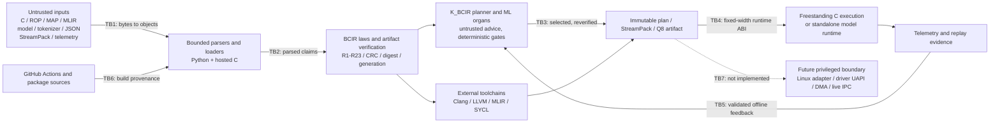

# BCIR security threat model

> **Model date:** 2026-07-15. **Audited base:** `6e7cd7d4`.
> **Detailed findings:**
> [`BCIR_SECURITY_RED_TEAM_AUDIT_2026-07-15.md`](BCIR_SECURITY_RED_TEAM_AUDIT_2026-07-15.md).

## Security objective

Hostile source, model, manifest, telemetry, and wire inputs must either become one
bounded, unambiguous, law-verified artifact or fail before externally visible mutation.
Learned cost data may influence selection only after validation; it never defines
legality. No pointer, mutable Python object, or unverified code path may cross a future
process/kernel boundary.

## System and trust boundaries

TB7 is intentionally dashed: current RuntimeChannel is an in-process vtable. The
future Linux/native transport is a new security boundary and is not implied safe by
the direct implementation.

## Assets

| Asset | Required property |
|---|---|
| Invoking process memory and control flow | No out-of-bounds access, use-after-free, double-free, integer-wrap allocation, or executable staging substitution. |
| BCIR legality and plan integrity | One canonical parse; complete graph/resource/claim identity; deterministic law checks independent of learned data. |
| Model/tokenizer/Q8 artifacts | Digest, CRC, shape, span, ownership, bounds, and tied/untied-head identity remain coherent. |
| Telemetry/calibration/replay | Poison, suppression, loss, reorder, stale generation, path replacement, and ambiguous records are detected rather than silently steering a plan. |
| Filesystem and developer host | No shared-temp executable trust, uncontrolled worker explosion, symlink clobber, or indefinite generated child. |
| CI source and token | Immutable action identity and least-privilege token; downloaded artifacts verified before use. |
| Future device/kernel state | Capability-scoped handles, byte offsets, generation, ownership, cancellation, IOMMU isolation, and peer-death recovery. |

## Attacker capabilities

The model assumes an attacker may:

- supply arbitrary source, MLIR, StreamPack, telemetry, model, tokenizer, manifest,
  proof, prior, schema, and graph inputs to the corresponding local API;
- race calls from multiple threads and replace a path inside a directory they control;
- pre-position files in a shared temporary directory on a multi-user host;
- publish a malformed provider/plugin object after it is intentionally loaded; and
- compromise a mutable package/action reference or make a toolchain hang.

The model does **not** assume the attacker already has code execution in the same
Python process, root/kernel execution, write access to a trusted output directory, or
physical/IOMMU-bypassing device access. Once arbitrary same-process native/Python code
is admitted, BCIR's registries are not an isolation boundary.

## Security invariants

1. **Parse once, interpret once.** Duplicate keys/IDs, unknown required fields,
   coercion, non-finite values, trailing bytes, overlap, holes, and noncanonical forms
   are rejected.
2. **Bound before work.** Bytes, dimensions, recursion, graph inventories,
   materialization, offsets, pointer arithmetic, worker count, and child duration have
   explicit ceilings before allocation or mutation.
3. **Preflight then commit.** Loaders and graph admission construct temporary state;
   published outputs remain zero/valid on failure. Growth preserves the old object.
4. **One owner.** Hosted allocations have an explicit owner and idempotent destroy;
   freestanding code is heap-free; borrowed C data carries a frozen-lifetime contract.
5. **No stale identity.** Resource, mapping, calibration, model, plan, session, and
   device generations/digests are checked at consumption.
6. **Serialize temporal transitions.** Publish/read/overwrite, registry installation,
   lifecycle close/use, policy replacement, and file identity transitions are atomic
   within the documented in-process model.
7. **Legality is deterministic.** Telemetry and ML/Q8 priors are advice. Activation is
   content-addressed, reverified, and occurs only at a quiescent generation boundary.
8. **No implicit privilege.** Current APIs run as the caller. A future privileged
   adapter accepts fixed-width handles/offsets, not paths, pointers, Python objects, or
   unchecked variable graphs.

## Principal abuse paths

| Abuse path | Impact before controls | Implemented controls | Residual condition |
|---|---|---|---|
| Malformed size/span causes wrap then short allocation/read | Memory corruption, crash, data disclosure | Checked add/multiply/alignment/span, payload non-overlap, complete preflight, sanitizers/fuzz | New wire fields must use the same helpers and negatives. |
| Duplicate/ambiguous artifact is authorized differently by two rails | Artifact substitution, wrong plan/model | Strict duplicate-key JSON, exact schemas, canonical ordering, CRC/digest/generation, Python/C parity | External vendor formats may require an explicit normalization profile. |
| Concurrent parse/registry/provider call observes another request's state | Cross-request claim binding or plan steering | Parser-local resolver; locked atomic registries/snapshots; duplicate backend refusal | Direct mutation by already-trusted same-process code is not sandboxed. |
| Ring/file event is torn, overwritten, reordered, or redirected | Calibration poison/suppression or audit loss | Serialized in-process transitions, loss witness, schema validation, no-follow/stable inode checks | Live cross-process SPSC publication is not implemented; hostile parent directories remain forbidden. |
| Dispatcher/cache is closed or replaced during compilation/execution | Stale-path execution, use-after-close, crash | Serialized lifecycle, cache invalidation, private temp directory, bounded geometry | External compiler itself needs a service-level deadline/sandbox. |
| Shared temporary bootstrap is pre-positioned | Conditional local privilege escalation | Private owned cache, immutable version/hash, no symlink/unowned executable, private staging | Package repository and TLS roots remain external trust. |
| Stale KV/device/session generation or forged graph is certified | Cross-session data use or false proof | No live-page eviction, generation advance, complete canonical batch graph checks, collision-free IDs | Multi-tenant page reuse is absent; design it with zeroing/epochs before enabling it. |
| CI action/build dependency changes underneath a commit | Build compromise/token abuse | Commit-SHA actions, read-only token, setuptools security floor, source hashes | Enable Dependabot; apt/package mirrors remain trusted infrastructure. |
| Future user supplies pointer/path to privileged driver/service | Arbitrary kernel memory/file access | **Not yet implemented:** roadmap requires generation-tagged capability handles, byte offsets, copy/length validation, bounded rings, cancellation, IOMMU | Must receive a fresh threat model, KUnit/fault/syzkaller tests, and direct/IPC parity before landing. |

## Future driver/UAPI requirements

Before any BCIR process or kernel component gains privilege, the interface described in
[`../kernel/BCIR_DRIVER_KERNEL_ROADMAP.md`](../kernel/BCIR_DRIVER_KERNEL_ROADMAP.md)
must enforce:

- append-only fixed-width `open/claim/map/submit/sync/event/cancel/close` structures,
  explicit endianness, version and feature negotiation;
- capability handles tagged with generation and owner, byte offsets instead of raw
  pointers, checked copy lengths, IOMMU mappings, and revoke-on-close/restart;
- bounded SPSC rings first, acquire/release per-slot publication, sequence/loss
  evidence, explicit full-queue policy, peer-death recovery, and no quiescent-parser
  reuse;
- one completion/cancel/timeout outcome, no double completion, and safe teardown with
  in-flight DMA/events;
- direct-vtable versus Linux/native adapter behavioral parity; and
- KASAN/KCSAN/UBSAN/KFENCE/kmemleak/lockdep, fault injection, KUnit, kselftest,
  syzkaller, and multi-architecture CI before promotion.

## Accepted residual risk

- The C compatibility frontend wrappers remain non-thread-safe; context APIs are the
  concurrent interface.
- Quarantine policy and RuntimeChannel hook storage are borrowed and must outlive use.
- Developer codegen APIs call resident compilers. The test inventory bounds children;
  a future service must supply stricter per-request cancellation and sandbox policy.
- Native Windows and ARM behavior is CI/hardware-gated from the current x86 workstation.
- BCIR does not patch the host kernel. Keep WSL/Linux at a vendor-supported security
  release and reevaluate newly disclosed namespace/network attack paths.

Revisit this model before the first resident driver, any IPC/live-ring implementation,
any privileged compiler/model service, and every wire-format or allocator change.
